# 战神

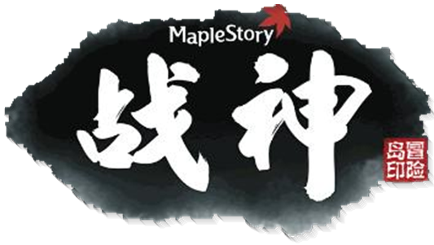

> 别担心，我是战神，我很快回来的。

[[toc]]

- 原帖地址：http://www.kmsfan.com/forum.php/thread-4739-1-1.html
- 作者： 丨叶枫丨
如需转载请务必保留作者信息，注明转自剧情组并附上原帖地址

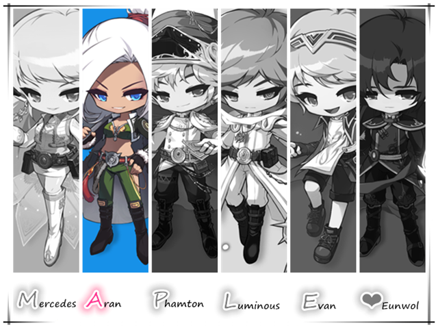

## 人物信息

**战神（Aran）**

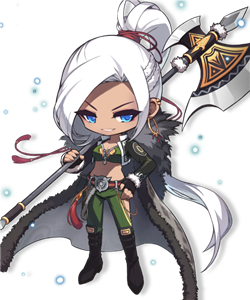

**所属势力**：英雄团

**武器**：战斧·摩诃

**称号**：最强战士

**能力**：COMBO连击

**身份**：战斧摩诃的主人

## 历史

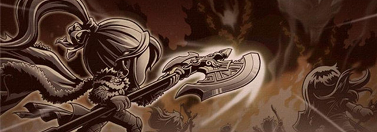

- 在500年前的“上古之战”中，战神在身负重伤的情况下依然坚守约定赶赴前线战斗，以自己作为护盾抵挡敌方兵力助攻其他几位英雄合力封印了黑魔法师。一场巅峰大战过后，英雄们纷纷遭到黑魔法师的诅咒，而战神更是命悬一线，为了保住战神的性命及减缓诅咒的恶化，寄宿在战神武器中的战斧之魂摩诃将她带到里恩岛封印起来，而后，摩诃也伴随主人陷入沉睡之中…

## 人物传记

### 【EP0】少女的呼唤

- 里恩岛，位于明珠港西南部附近，这里冰雪覆盖四季如冻，有着由纯净寒气构造的冰川，往人稀少。500多年前的大战，战神就被封印在这里。里恩一族一名叫利琳的少女根据预言记载，在这里苦苦等待战神的苏醒。终于有一天，这位上古英雄缓缓睁开了眼睛…

### 【EP1】踏上修炼之路吧！

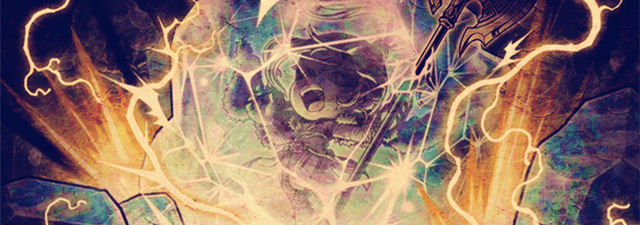

- 战神苏醒的消息震撼了整个里恩岛，但令人遗憾的是 这名伟大的英雄在长年的诅咒及冰封中丧失了一切记忆及能力…在利琳简单的指导训练下，战神开始了自己的修炼之旅，迈出里恩岛重新认识这个世界。

- 利琳介绍她到明珠港的情报商人特鲁身边，开始了情报搜集的工作。战神的第一份工作是到射手村去调查花蘑菇，与布鲁斯的合作下，发现是“人偶”令蘑菇发生变异的原因。随后战神也去过魔法密林调查，三次平定南部森林的绿蘑菇内乱，了解到让怪物变凶暴是人为所行，同时遭到一个叫弗朗西斯的少年 自称黑色之翼成员的严厉警告。得知黑色之翼将会危害整个世界，战神的斗志更加高涨，决定不向邪恶势力低头！在往后的勇士部落与林中之城的调查中，战神发现弗朗西斯已将“人偶”散布整个金银岛 扰乱了人们的生活，于是战神顺藤摸瓜查到弗朗西斯的底细，一举前往其窝巢将他教训一番，并从中抢来给黑色之翼的报告书。经利琳解密后，得知黑色之翼正四处搜寻一种叫“封印石”的东西，而弗朗西斯就是通过人偶控制怪物助他寻找“封印石”。在报告书中还看到，弗朗西斯的计划已被战神三番四次捣毁，但他已经向组织要求强力的支援！看到这里，战神的额头似乎冒出一丝冷汗…

### 【EP2】 战神与摩诃

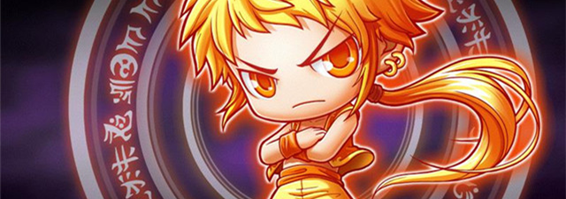

- 就在此时，旁边巨大的战斧“嗡嗡”作响激起强烈的震动，利琳称英雄的武器拥有自我意识，这是呼唤主人的反应。战神靠近一看，冒出个傲慢而又凶巴巴的少年，自称是战神的武器，名叫摩诃。面对完全失忆的战神，摩诃显得相当失望…利琳相信这个武器能对恢复记忆有帮助，于是指引战神去镜洞寻找记忆。在镜洞里，战神看到了自己和摩诃的过去- 摩诃是世界上著名的铁匠所打造的长矛武器，其灵性独一无二，锋利无比，就连自己的主人也会伤害。而能征服这把武器的人，就是战神。独一无二的灵性与无坚不摧的意志互相组合，造就了“战神”这股力量，能与上古巨魔黑魔法师抗衡的力量！在摩诃的唤醒下，战神总算恢复了一部分记忆…

- （从战神与摩诃深刻的对话中可以看出，他们的感情似乎早已超越了主仆之间的关系，他们给人的感觉就像是一对天生的搭档）

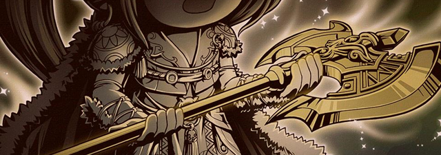

### 【EP3】 痛打人偶师！

- 不久之后，弗朗西斯带上同伙乔装成特鲁设下圈套要对战神下手，在明珠港的情报屋里两人展开激烈的战斗，虽然弗朗西斯这次明显有备而来，但依然不敌战神最终惨败而退。特鲁判断黑色之翼这次劳师动众正暴露他们的阴谋，决定追查下去并加快搜寻金银岛封印石的下落。经一番探查特鲁发现弗朗西斯在魔法密林的北部森林又建立了根据地！刻不容缓，战神奔赴敌人巢穴再一次教训了弗朗西斯，在战神压倒性的实力下弗朗西斯锐气大削，痛哭而逃。后来特鲁抢先一步找到了金银岛封印石，并叮嘱战神将封印石交给利琳保管。

### 【EP4】 天空之城的恐慌

- 为了扩展情报面，特鲁已在神秘岛大陆展开搜索，发现天空之城出现了恐慌，那里的妖精们都没觉好睡，于是让战神前往探查。经一番询问后，战神了解到是由于巨大食人花发出的噪音扰乱妖精的睡眠，并在人迹罕至的山路发现了急促成长催化剂，这就是导致食人花变大的原因。妖精们都生怕食人花变大会领天空之城有沉下去的危机，带着种种疑问，战神来到云彩公园向巫女斯皮罗纳询问。不问则已，一问却问出个惊天阴谋！原来那条人迹罕至的山路连接着天空之城最神圣最机密的地方- 封印庭院，估计天空之城封印石已遭到入侵者的窥视。斯皮罗纳占卜过战神的身世，惊奇地发现她非一般凡人，于是拜托战神将入侵者击退。

- 战神重返山路，果真发现一条高耸的树藤向封印庭院延展。进入庭院，看到封印石已被一个自称塔高斯的人得手了，并向战神发出挑战，两人随即展开激烈的战斗！几下回合后战神明显占上风，正是击倒高塔斯之时，另一名带墨黑眼镜的同伙突然现身并抢走了天空之城封印石，扬气而走。带着沉重的消息战神回到里恩，虽然知道失去封印石并不会对天空之城产生直接影响，但战神依旧为自己没能守护住封印石而感到失落…

### 【EP5】 武陵危机

- 过了一段时间，特鲁向战神发来情报，说武陵的陈道人跟黑色之翼有过接触。于是战神赶往武陵，对陈道人细心盘问，发现确实有隐情。原来有个黑色之翼的武士威逼陈道人，要求他将一份画轴交给武陵的长老武公，谁知陈道人错失将画轴弄脏了，字体乱七八糟的。在战神的帮助下总算恢复了字体，但一看到画轴的字体，战神大吃一惊 原来黑色之翼要对武陵封印石下手！战神必须要向武公报告此事，但以战神现在的等级根本无法达到武陵道馆的顶层见他，于是陈道人向战神推荐了一条后门，通过“巴结”武公之徒萧公，战神终于到达道馆顶层，向武公说明了这一切。在两人的对决后武公也看出了当年英雄的气魄，并请战神以英雄后裔的身份去会一会敌人。在隐秘的武陵寺院里 战神见到了这次的主谋 影子武士，并声称要以黑色之翼的名义除掉战神。大战一触即发！几轮较量后 战神发现这个影子武士明显跟前几个对手不是一个等级，尽管对手很强势 但战神依然以顽强的实力将其击倒，就在此时又出现了上次同样的情况，封印石被带墨黑眼镜的同伙抢走了！

- 战神再一次失利，她很自责。带着难受的心情回到里恩岛向利琳转达这次事情，利琳意外地发现，封印石都是当年由战神本人亲自交托到各地的！在利琳的鼓励下战神斗志昂扬起来，重新振作投入修炼的旅程。

### 【EP6】 摩诃又在吵了！

- 不久后，战神收到利琳的传话，说战斧又出现奇怪的反应。她回来一看，发现摩诃在大吵大闹地喊捉小偷，然而除了战神之外居然没有人能听懂摩诃的话… 小偷大摇大摆盗走了摩诃的宝石红珠玉，自己没办法只好命令战神立即去捉住小偷，在码头 战神确实发现了小偷乌鸦并将其赶走，但却没带回红珠玉。听到这个消息的摩诃吵得更厉害了，嚷着非要重新造一颗红珠玉。看着摩诃气在头上战神也无奈了，在利琳的建议下 她再次去了镜洞，希望能找回红珠玉的制作方法。在镜洞，战神回忆起自己和宝石工匠雪人的事，小偷乌鸦是个专偷宝石的盗贼，在某一天 它偷走了宝石工匠的红珠玉，被路过的战神收拾了，于是战神跟宝石工匠雪人成了好朋友，并将红珠玉送给战神。从镜洞回来的战神 根据红珠玉的配方重做一个送给摩诃，收到宝石的摩诃终于平静了下来，借助红珠玉的力量唤醒了战神部分过去的战斗记忆。

### 【EP7】探访艾琳森林

- 战神又重新踏上了修炼之路，出发前收到特鲁的情报，据说玩具城掌管时间的赫丽奥斯塔出现了空洞，可以回到战神生活过的时代，说不定会遇到认识的人！于是战神就一边修炼一边向着玩具城的方向进发。

- 在赫丽奥斯塔的时间空洞里战神走进一个茂密的森林，发现果真有人认识自己。一个叫友里索的中年妇女热情地欢迎着战神并指引她去见赫丽娜，但失忆的战神面对这一切感到不知所措。于是赫丽娜重新向战神介绍，原来这里是“上古之战”几个月后的世界，当年战神身负重伤保护了赫丽娜等一众人离开战场来到这个艾琳森林，在赫丽娜的带领下人们在此定居下来并开拓这片土地。战神了解过后向赫丽娜说明了关于封印石的事，赫丽娜回忆起确实有这么一回事，由于太忙所以让战神亲自去图书馆拿。当战神一进入图书馆就微微感觉到一股奇怪的气息，找了一遍都没发现封印石，正在思索之时，突然冒出一个熟悉的身影，自称是黑色之翼的墨镜将军，三番四次在战神面前抢走封印石的男人。而这次也不例外，瞬间消失得无影无踪。得知此事的赫丽娜自责起来，但同时也联想起一个重要线索，原来当年的战神写过一封关于封印石的信。戏剧性的是，战神居然拿不起那封信，因为他们是两个不同时空的人，面对此景两人轻轻感叹… 于是赫丽娜决定保存好这封信约定与战神在未来相见，因为赫丽娜是精灵，比起人类有着惊人的寿命。带着这种信念，战神离开艾琳森林，回到自己的世界。

### 【EP8】参加大陆会议

- 在询问过特鲁后得知赫丽娜的风云历史，战神立刻奔赴射手村，在弓手培训中心里惊现赫丽娜遭到黑色之翼成员巴洛克的暗算！战神愤怒将其击倒并救醒赫丽娜。收回信件后战神回去与特鲁一起商量，信里虽然全是暗号，但特鲁估计黑色之翼已经知道里面的内容了，于是立即让利琳过目。经利琳研究后惊奇地发现，原来战神是给当年圣地的女皇写了这封信！得知圣地封印石的存在，战神马上动身赶往圣地告知此事。

- 不久之后，战神得到圣地的承认，并邀请她参加枫世界第一届“大陆会议”，于是战神跟随着赫丽娜来到圣地。为了实现各自的理想和自由，在很多人参加的大陆会议上，希纳斯女皇与反抗者代表吉格蒙特、冒险家代表赫丽娜手牵手，团结一体，象征联盟成立。会议上战神接受了希纳斯女皇的觉醒仪式，并获赏联盟长矛及象征着联盟成员的勋章一枚。

### 【EP9】暴走的摩诃？！

- 在战神前往圣地期间 利琳发现摩诃身上有种沉重而痛苦的反应，散发着不详的杀气，让战神速回里恩。战神回来一看，摩诃行为怪异，挣扎地向战神诉说着自己的痛苦，在两人被冰封地数百年间，没有主人陪伴的摩诃饱受孤独的折磨，任随时光流逝始终听不见主人的呼喊，内心的畏惧孕育出一股冰冷的黑暗力量，本以为主人苏醒后就可以在一起战胜黑暗。但由于战神的失忆及所有能力的丧失，一直对摩诃不理不睬，摩诃内心的恐惧依然不断扩展，如今已到了无法控制的地步…

- 瞬间，里恩岛成了两人的战场，暴走的摩诃对自己的主人展开疯狂的攻击，让战神毫无招架之力。开始战神也不忍心对自己的搭档下手，可是逐渐解放力量的摩诃将会危及整个岛屿！为了挽救忠实的搭档，为了阻止这场灾难，战神当机立断向摩诃发起还击。战斗碰撞的火花四溅，狂风乱起，经过几十回合的搏斗，战神以惊人的毅力终于打败暴走的摩诃。 摩诃醒来后感到很欣慰，大赞战神的成长惊人，而后与主人强烈的信念产生共鸣，唤醒了战神全部的力量。

### 【战神与龙神的剧情联动】

1. 第3章中战神对作恶多端的弗朗西斯多次教训造成重伤，后来被龙神埃文间接救助了。

2. 第4章中之所以有巨大高耸的巨滕延伸到庭院，是黑色之翼利用了龙神埃文制造出植物促进剂。

## 特殊专栏- 极具争论

### 战神当年救下的孩子是凯琳？

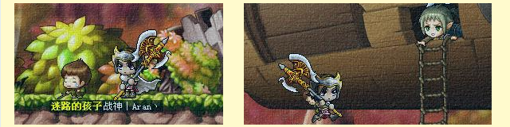

- 战神的开场剧情相信大家都记忆尤深，在体验炫酷的技能中 还穿插着一个救孩子的剧情，当时的战神已是身负重伤，救出孩子后 她依然遵守约定前往前线战斗到底。我阅览众多论坛及贴吧，发现都有“战神救过凯琳”的说法，有的是谣传，有的是推测，然而在2009年有这个猜测也不足为奇，毕竟剧情党的好奇心总能让他们脑洞大开，而当时的剧情是零零散散不完整的，无法给出准确的答案。而随着版本的更新，在“艾琳森林”系列任务中官方给出了明确答复。言归正传，那么这个孩子到底是不是凯琳呢？

显然，答案是否定的。（截图出自艾琳森林的主线剧情）；也就是说，战神救孩子的时候凯琳还未出生

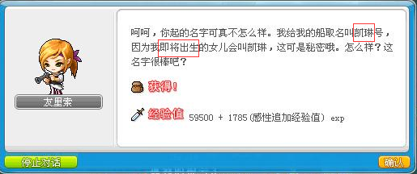

### 战神的性别？

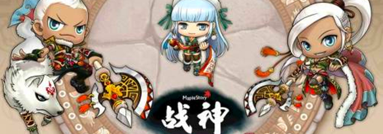

- 战神是继骑士团后再次提到黑魔法师的职业，进一步开拓了黑魔法师时代的故事，冒险岛的主线剧情故事的繁荣由此开枝散叶。继后来的幻影、双弩、夜光职业逐一觉醒，剧情线路越来越明朗，设有性别选择，无论是选男性还是女性都不会对宣传片及往后的主线剧情造成影响。而相对于初期出道的战神，在方案还未明确、设计尚有缺陷的情况下，TA的性别确认饱受争议。

我们先来整理下官方对战神性别的设计。（按时间先后排序）

1. 出自韩服八周年宣传PV，最先以女性姿态展现。
2. 出自大乱斗宣传PV，仅次于八周年PV发表。
3. 出自V100版本，十字团后续剧情。第一次以男性姿态展现，性别的争论由此展开。
4. 同属于V100版本的联盟会场，同一个版本出现两种性别的战神，争论越发激烈。
5. 出自幻影过场动画，同样是联盟会场，又是两种性别……（此时玩家的心声是- N社你TM在逗我？(╯‵□′)╯）
6. 出自幻影的主线剧情再次以女性NPC形态出现。那么在幻影剧情中战神过场动画是男性，主线剧情是女性…   
（玩家对性别的争论到达巅峰，甚至以有“不男不女”的说法在传播。）
7. 出自夜光的开场剧情，与幻影的剧情相呼应，同为女性
8. 出自冒险岛fanbook《SECRET STORY》，官方读物，里面详细介绍了五位英雄，图文并茂并配有原创的短篇漫画，发行时间是2013年，由于限售于韩国，在国服是鲜为人知的。本书的封面被安排了男性战神以面世。
9. 同上，书中对战神性别的决定也是十分模糊，依然出现两种性别。
10. 同上，原创漫画部分，用漫画表现了战神开场剧情。（在本书战神方面的介绍中出现“男多女少”的性别10：比例。）
11. 出自神之子剧情，将战神性别锁定为男性。
12. 出自隐月的开场剧情，与幻影、夜光的剧情一致。
13. 出自隐月的过场动画，与前者相呼应。
14. 出自副本“黑色天堂”的过场动画，以女性姿态出现。
15. 官方在2015年11月发布的消息，对所有英雄的形象重新设定，其中战神以女性姿态展现。
16. 出自副本“枫叶英雄”的过场动画，以女性姿态出现。

#### 列表归纳：

性别 | 出现次数 | 比例
----| -------| -----
男 | 5 | 31%
女 | 11 | 69%

- 由此看来，战神的性别的设计一路以来都是曲折而又善变，其中以女性姿态居多，目前官方依然还没有明确的答复，不过根据近两年来的新职业内容和新设定来看，战神是女性的走向越来越明显。

- 可见，战神初期出道的时候只是作为一个“职业”而非“角色”，可以说是从双弩精灵开始后才真正有了“职业角色”的情况，从这以后出现有明确身份的“职业”是有人物原型的，即便设有性别随意选择，但并不会影响其主线剧情。

- 最初战神的形象也有男女两份立绘，作为职业虽有性别的选择，但其选择性是硬性地绑定了玩家账号的性别。但在双弩精灵出现后，官方发现当各位英雄的剧情故事产生交集时，角色没有固定性别的话在故事层面上会漏洞百出，所以在那以后官方便为角色设计固定性别及特定的人物背景身份。

### 性别比例论

- 战神- 力挽狂澜、威风凛凛，巨灵开山之矛一挥，舞动出钻石星辰的光芒。虽然绝大多数玩家都觉得战神的形象更符合用男性去表现，不过由于陆续出现的英雄职业已经严重影响了其性别比例，（英雄团会变成和尚团…？）所以先天有性别缺陷的战神不知是福是祸被“当”成女性。而4男2女的英雄团一直高度活跃于同人届，这也说明了女性的战神更受玩家欢迎，更符合性别的逻辑。

以上图片均源自网络

## 相关介绍

### 战斧·摩诃

- 摩诃是世界上著名的铁匠所打造的长矛武器，其灵性独一无二、锋利无比，就连自己的主人也会伤害，当年战神为了驾驭摩诃确实下了不少苦工，独一无二的灵性与无坚不摧的意志互相组合，造就了“战神”这股力量，能与上古巨魔黑魔法师抗衡的力量！摩诃拥有自我意识，外形跟人类很相像，是个留着一条长发鞭的男性，平时寄住在武器里面，性格傲娇也不失可爱，对自己的主人忠心耿耿，跟战神有着深厚的羁绊。

### 里恩一族

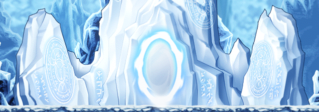

- 里恩一族的人世世代代就遵循预言记载 在岛上等待英雄的苏醒，经历几百年的风尘，始终没有英雄的发现，人们纷纷对预言产生怀疑，失去对英雄传说的信仰，为了谋取生路很多人都离开里恩岛，唯独有一个小女孩依然坚守这份信仰，她就是利琳。利琳还有一个长兄，他就是家喻户晓的女皇骑士团参谋长南哈特，他跟村人一样失去了对英雄的信仰离开里恩，后来坚持自己的正义被推荐成为现任女皇希纳斯的导师，是辅助希纳斯及骑士团成长的核心人物。两兄妹之间似乎有些间隔，后来在圣地举行的大陆会议上见面，两人露出坦诚的笑容。

### 艾琳森林

- 形象地来说，艾琳森林就是过去的金银岛，由于玩具城的时间塔故障出现裂缝，透过裂缝可以回到过去。上古之战灾难时期，赫丽娜率领一众难民在米纳尔森林乘坐方舟逃生，身负重伤的战神也被安排到方舟上，但战神没上船，救下失踪的孩子后就赶往前线与黑魔法师战斗。当时方舟遭到飞龙的袭击迫降在南部平原，于是赫丽娜带领难民在此定居下来，一边修生养息一边向外扩展，准备建造新的村庄。

## 能力相关

### 职业亮点

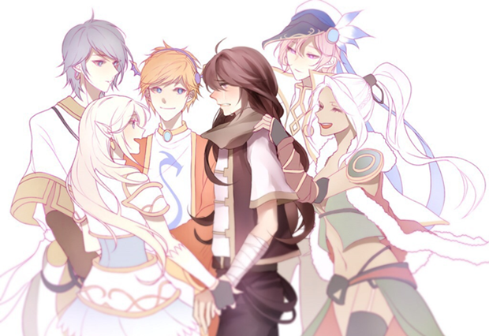

- 战神特有的COMBO连击方式开创了冒险岛普通攻击的先例，是一个创新性的突破，以攻击键为主，攻击怪物累计到一定的COMBO即可创造华丽的连击。也许你还记得，开初战神攻击怪物的数量是15！绝对是个霸道的王者。战神是一个另类操作的职业，体现在玩家的灵活应变和连击操作上，而输出在二线范围，有着高防御、高抗性的特点，攻击速度虽然无法跟其他英雄能比，但胜在招招暴力，在控场与清怪方面相对突出，是个可靠的潜力股。

### 特色技能

- 粉碎潮浪	在长矛中注入斗气，投向前方的敌人
- 战神突击	迅速向前突进并一同击退前方的敌人
- 摩诃审判	将长矛反抓猛烈向地面锤击，并将地面的敌人震荡到空中冰冻起来
- 终极投掷	悬空跳跃起来将前方的多个敌人抛击到空中，以便造成更高的连击伤害
- 聚集捕手	以长矛的尖锐端作钩子，大范围地将敌人拉拢起来
- 巨熊咆哮	战神的连击精华技能，用力挥舞长矛，召唤巨大的熊精灵创造超大威力攻击
- 摩诃祝福	将摩诃的祝福传递给队友，使其战斗力提升一个层次
- 摩诃领域	召唤出沉睡于里恩岛的巨大战斧摩诃，在广域范围内敌人受到持续的伤害，并能解除周围队友的异常状态
- 比昂德	与摩诃一同产生强大的共鸣，施展出力量最大化的多重连击
- 抗压 在自己的周围形成凌冽的寒气，与敌人产生碰撞时反射冰冷的伤害

## 对战记录

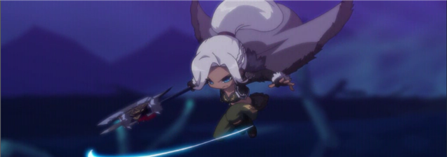

交战对手 | 结果 | 备注
-------| -----------------| ----------
黑魔法师 | 胜 | 助攻，在身负重伤的情况下死守大门以助其他几名英雄封印黑魔法师
弗朗西斯 | 完胜 | 前后将其教训了三次
斯高塔 | 胜 | 将其击退，唯憾天空之城封印石被同伙抢走
武公 | 胜 | 切磋武艺
影子武士 | 胜 | 将其击退，唯憾武陵封印石被同伙抢走
小偷乌鸦|胜|为抢回被盗走的红珠玉将其教训
巴洛克|胜|赫丽娜遇袭昏迷，出手救助
暴走摩诃 | 险胜|为挽救被黑暗吞噬的摩诃不得不出手战斗

## 经典语录

### 战神

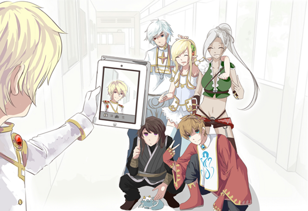

1. 赫丽娜，你一定要活着，我们会再见的！我必须要同我的伙伴们去战斗！
（这是500年前 大战前夕战神对赫丽娜的约定）

2. 不好意思，我失忆了，我不记得你…

3. 我还很年轻。
（面对特鲁的夸赞显得相当平静而谦虚）

4. 双弩…精灵…？是谁啊？
（谈话中聊起过去的同伴，战神依然失忆中……）

5. 对不起…摩诃，要是我能更强一点的话…

6. 别担心，我是战神，我很快回来的。
（在过去的米纳尔森林遇到玛瑙龙之王阿弗利埃，展现出一幅温柔可靠的大姐姐样子）

7. 黑色之翼也许在打这里的注意。
（突然说出这样的话甚至被南哈特误以为是坏人）

战神总是给人一种天然呆的感觉，但其出众的相貌与俊逸潇洒的硬朗气质又十分不符，形成一种反差萌。她甚至有点笨拙、寡言少语，为人重情义、有责任心，经常以战士的定义衡量自己，是个稳重的实力派。

### 摩诃

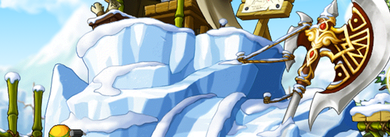

1. 说声不好意思就能算了？几百年来我一个人孤苦伶仃的，有多寂寞你知道吗？！
（一直很渴望得到主人的关心，但是失忆后的战神对他的态度总是不冷不热的 因而积攒了很多负面情绪）

2. 要知道像我这样优秀的武器，你上哪里去找啊？能够和黑魔法师抗衡的强大力量就是我了！
（对自己的力量很有信心的说）

摩诃有点小傲娇，也不失可爱的一面，对自己的主人一直很上心。与战神有着深厚的羁绊，但经常为失忆的主人感到担忧而又着紧；虽然跟主人的性格完全相反，但他们的组合简直就是天生一对。

### 利琳

1. 呵呵呵~太好了，现在又斗志昂扬起来了吧！不愧是战神。

2. 真是的，又不是什么小姑娘，一把武器有什么好臭美的呢！不过不管他又不行…
（经常跟摩诃闹不和……但心底是非常关心的）

3. 我好想拿到扎昆头上的鲜花呀，为我采一朵的话，我就跟你一起喝茶，轻松地聊天。
（非常难得才能见到利琳有这么天真的一面！）

利琳是个坚强而又执着的女孩，偶尔跟摩诃闹闹脾气，为了战神她付出很多很多…她幽默而又天真，生气的时候会露出肉食暴龙般的微笑，开心的时候会说出不符合年龄的胡言乱语，深不见底的心思难以猜测，属于冰山系美女。

## 扩展阅读

[剧情小组]枫之地理 洋溢无限生机的艾琳森林：
http://www.kmsfan.com/thread-4781-1-1.html

[剧情小组]第2英雄 龙神Evan剧情介绍：
http://www.kmsfan.com/forum.php/thread-4743-1-1.html

剧情组出品—

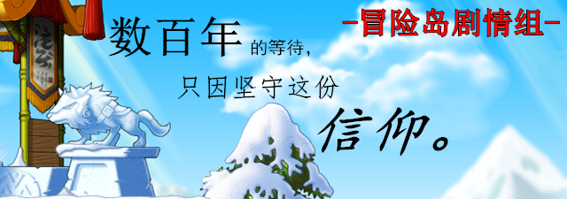
