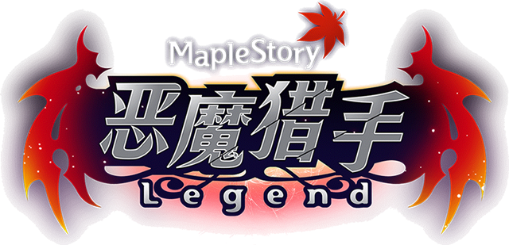
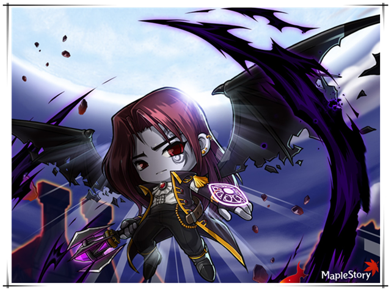
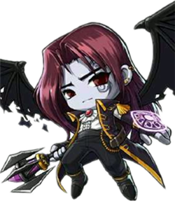
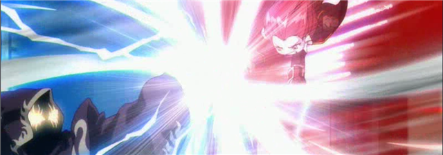
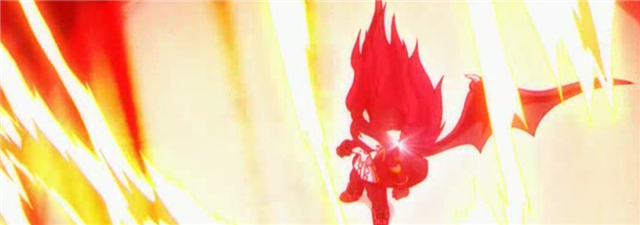
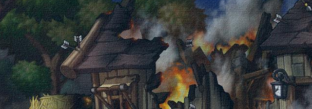

# 恶魔猎手

[[toc]]

- 原帖地址：http://www.kmsfan.com/thread-4835-1-1.html
- 作者：苍月

如需转载请务必保留作者信息，注明转自剧情组并附上原帖地址

## 人物信息

**恶魔猎手（Demon Slayer）**

**所属势力**：冒险联盟军

**武器**： 狮心震雷钉（原）、地狱风向标（现）、精气盾

**称号**：复仇者

**能力**：精气吸收、血之力量、黑暗咒术

**职务**： 现属冒险联盟军特遣队（原是黑魔法师军团的军团长）

## 历史

- 500多年前，一名人魔混血的少年为了家人毅然加入黑魔法师的军队中，在无数次的生死搏杀中他淬炼出了无与伦比的强大实力，也因此他受到黑魔法师的宠信。时值战争末期，由于阿莉亚女皇遭到翼魔的暗杀，圣地陷入半沦陷状态，以龙神法师弗里德为首的五名英雄发起了最终的反击，也就在这个时候，黑魔法向阿卡伊勒下令毁灭神木村全境。

- 当时完成占领时间神殿任务并暂时封印女神的恶魔猎手，在军团长会议上从班·雷昂口中得知消息后赶回家，却没想到等待他的是绝望的冰冷……当他向亲信马斯特玛下达了最后帮助五位英雄的命令后，恶魔猎手带着玉石俱焚的决心进入神殿深处与黑魔法师一战。

## 剧情简介

### 【EP-ZERO 序章】

- 五百年前驰骋战争，即便是英雄们也无法单独敌对的恶魔猎手，因为疯狂科学家格里梅尔的实验沦为能源汲取装置，反抗者成员J在潜入奥尔卡创立的组织“黑色之翼”后，意外发现醒来后击败大量看守兔子的恶魔猎手，由于恶魔猎手耗尽了力量再度陷入沉睡，J将其救走带回反抗者本部。

### 【EP-ONE 时代的变迁】

- 醒后发现身处陌生环境的恶魔猎手缓缓回忆起过去发生的事，在他仔细检查了自身的状况后意外地发现原本引以为傲的坚强实力已经衰败到不容目睹的地步，正当他打算外出活动的时候听见了反抗者众干部的对话，在与他们的交流中惊愕得知时间已经过去了五百多年，百载光阴犹如白驹过隙的感觉令他难以适应，更加无所适从的是黑魔法师居然被那五名英雄击败并封印了起来，原本属于黑魔法师的军团长们全部都销声匿迹，在佩尔迪校长的认可与邀请下，恶魔猎手选择加入“反抗者”阵营。

### 【EP-TWO·磨合】

- 在伊莱克斯和吉格蒙特的帮助下恶魔猎手尝试恢复力量的方法，并在期间帮助了埃德尔斯坦人民解决不少麻烦后，恶魔猎手终于获得了大家的信任，而在这个过程中恶魔猎手也经历了从未有过的安逸与舒畅，原本潜藏在心对人类的隔阂也在缓缓消除着。

### 【EP-THREE·再会】

- 很快恶魔猎手接到了一个十分特殊的请求- 消灭盘踞在散步路公园的奇怪生物。隐约间有种莫名悸动的恶魔猎手在找到奇怪的生物后，比较轻易的结束了战斗后才发觉这头生物让他有种熟悉感，再彼此确认后发现这只奇怪的猫类生物居然是他曾经最信任的部下马斯特玛！从她那里恶魔猎手又了解到两条令他关注的消息：

1. 马斯特玛变成这样的原因。
2. 五个英雄因为黑魔法师的反扑受到强烈诅咒而纷纷陷入沉睡，但如今也都分别苏醒。

之后马斯特玛主动要求签订契约，签订契约后恶魔猎手的实力飞速成长了不少，同时为了便于马斯特玛的日常和其他行动，恶魔猎手对反抗者的其他成员说是他的宠物。（只不过专心于修炼和复仇的恶魔猎手似乎有点忽视马斯特玛的特殊情愫。）

### 【EP-FOUR·情报与翼魔】

- 马斯特玛带来了新的消息，居住在冰封雪域的阿尔卡斯特似乎知道不少关于黑魔法师的情报，但是当恶魔猎手赶赴冰封雪域后阿尔卡斯特因为感受到了他身上强大的黑暗不愿意接待他，将他婉拒并提出了苛刻的要求。在完成阿尔卡斯特的要求后终于令他松了口，并得知原本的同僚班·雷昂一直以来都居住在他的王城中，而且从阿尔卡斯特的推测来看黑色之翼的背后很有可能是某一名军团长。决定后闯入黑色之翼地下基地的他在扫灭了大量机器人后，在潜入“人偶师”弗朗西斯的房间后，恶魔猎手在他的日记本中发现了一张照片，照片中那娇俏的人赫然是当初攻入圣地的“翼魔”奥尔卡，那么黑色之翼难道就是由奥尔卡组建来复活黑魔法师的吗？那么，另外一个“翼魔”斯乌的去向呐？

- 得知恶魔猎手苏醒消息的双弩精灵特意来找他，在短暂的交谈后双弩精灵留下了警告离去，可很奇怪的是，这个女人给恶魔猎手的感觉是也变得好弱。

### 【EP-FIVE·力量的抉择】

- 被杀戮支配的死亡。被欲望支配的生存。被愤怒支配的灵魂。被时间支配的改变。当我苏醒的那一瞬间，向那个人复仇的火焰已经被点燃，为了这个目的，即便被地狱的红莲之火侵蚀我的灵魂也在所不惜！

- 当力量渐渐攀升回原本的层次后，恶魔猎手愈发感到的力量的迷惘，是选择愤怒的复仇之心来强化血之力量？还是缓缓修行推动自己进入比过去更高的层次？在马斯特玛的建议与帮助下，恶魔猎手进入了马斯特玛创造的特殊空间里与过去的马斯特玛幻象交战，在一番苦战后恶魔猎手领悟到了更强的力量，也明白了两种抉择的不同后果：

时间短、爆发力强的血之力量会给肉体带来沉重的负担。更加沉稳熟练的精气力量令他拥有更全面的作战方式。

- 在力量大幅度进步后恶魔猎手准备前往位于尼哈沙漠中的炼金术之都 - 马迦提亚。

### 【EP-SIX·禁忌的炼金术】

- 不好了!禁忌的炼金术秘典居然被盗取了。两大学派之一卡森在急切的情况下拜托恶魔猎手去助卡帕莱特协会会长麦麦德一臂之力，在击败了一名魔法师装扮的侵入者后卡森和麦麦德互相交流，得知封存的禁忌之书已经被盗走了，明白这份危害的恶魔猎手急忙追踪侵入者而去。在与几名魔法师的对峙中，恶魔猎手得知这些魔法师居然是另一名军团长 -  一直与他为敌的阿卡伊勒的部下。

- “那个该死的蛇男！原来是想用这特殊魔法来清除封印石将 那个人 释放出来！你以为我会让你们得逞吗？”在击败所有的魔法师后恶魔猎手将炼金术书交回给麦麦德，成功阻止了一次阿卡伊勒的阴谋。

### 【EP-SEVEN·可爱不是错，暧昧更加不是罪！】

- 在上次使用外星章鱼激光棒失败后，身处在炼金术之都的马斯特玛突发奇想使用炼金术的成果来恢复身体，无奈之下恶魔猎手帮她完成了心愿，喝下“紫色液体”的马斯特玛身体立刻发生了变化，居然……居然变成了过去的恶魔猎手！“这就是你想要的样子吗？”面对恶魔猎手的疑惑马斯特玛十分庆幸立刻变回了猫的姿态，可是你问我脸为什么这么红要我怎么回答啊！大笨蛋。

### 【EP-EIGHT·班·雷昂】

- 力量终于接近过去的水平了！恶魔猎手决定去冰封雪域顶端的王城去见一见当初的同僚班·雷昂，如果可以他希望能够说服那个固执的家伙。

- 比过去更加陈旧的王城内都是呆板的看守生物们，曾经繁盛一时的国度变成这样恶魔猎手也不禁默然，当他见到班·雷昂的时候发现这名出色战士的眼中都是疲倦。

- 令他惊异的是，即便五百多年内没有任何动作，班·雷昂依旧在心中将黑魔法师奉为神圣的主宰！以背叛者称呼自己的他一再试图赶走自己，但到最后也没有动手，不知有意无意地在恶魔猎手临走前告诉他：“时间神殿，那里也许有你想要的东西。”

### 【EP-NINE·完整的力量】

- 在向马斯特玛提出请求后，马斯特玛使用了最后一点力量将恶魔猎手传送到玩具城下方的时间通道，并从那里进入过去的时间神殿，在那里他看见了五百年前被绝望支配着意识的自己。

- 当面对过去的自己毫无保留的攻击，压榨尽每一分潜能的恶魔猎手完成了最后的蜕变再度拥有了过去的力量，而在他心里……不管是现在又或是过去，都有一句话深深地烙印下来：报仇之前，我不能输。

### 【EP-TEN·时间神殿】

- 在进入时间神殿后发现过去的战场此刻已经没有任何影子了，那个没见过的神殿管理者要求恶魔猎手通过测试后才能进入神殿。在神殿中恶魔猎手发现了一个少女的身影，而一头巨大的独角鲸鱼正顺着那名少女勾起的指尖前进着。

- "果然是奥尔卡。"

- 在哭笑不得交流后，恶魔猎手察觉到了不少端倪，奥尔卡也因为忌惮军团长中实力首屈一指的恶魔猎手而暂时离开，恶魔猎手随即在神殿内查找起奥尔卡动手脚的线索，在神殿怪物身上他发现了大量的“黑色证物”延缓了奥尔卡的计划，但是他心中的疑惑越来越深：斯乌究竟去了哪里？

### 【EP-ELEVEN·告白】

- 在时间神殿的时候马斯特玛又一次寻求恶魔猎手的帮助，在解决奥尔卡留下的黑色证物时恶魔猎手一并找到了马斯特玛需要的“时间沙漏”，使用了沙漏里的时间之沙马斯特玛终于如愿以偿的恢复了原样，在脸红心跳到几乎不能自已的时候，马斯特玛终于准备告白，可是最后的半句话终究因为半吊子的回复方法没有说出口，面对大惑不已的恶魔猎手马斯特玛只有把话题转了方向……

### 【EP-TWELVE·大陆会议】

- 在几次深切的交流下，反抗者和圣地之间的矛盾终于缓和了下来。就在这个时候黑魔法师的属下们已经蠢蠢欲动，世界各地都起了异常的状况，面对这个前兆圣地的年轻女皇希纳斯与谋士南哈特商量后，决定邀请世界上的各方势力组建联盟对抗即将复活的黑魔法师。

- 在精灵之王梅德赛斯和冒险家弓箭手教官赫丽娜的鼎力支持下，冒险联盟的事宜如火如荼地进展着，吉格蒙特也收到了来自圣地的邀请。

- 在向恶魔猎手咨询后，吉格蒙特决定参与联盟对抗黑魔法师，最初的一步自然是要推翻侵占埃德尔斯坦资源多年的黑色之翼。

### 【EP-THIRTEEN·神秘人物】

- 一件事早在去冰封雪域拜访阿尔卡斯特的时候就一直在困扰着恶魔猎手，在天空之城他见到了魔族！

- 销声匿迹不知多少年的魔族居然大批出现在天空之城，而其中一个神秘的人物居然带给了自己庞大的威压，之后在玩具城时他也见到了魔族，而这些魔族不仅认识他而且对他抱着深切的敌意，只不过第一次见面时那个神秘的魔族首领却一再阻止了手下对自己的攻击。

- 在时间神殿追踪奥尔卡时，那个神秘的魔族首脑再度出现，并将……那枚嵌着戴米安和母亲相片的吊坠！在与黑魔法师决死一战时就遗失的吊坠他是如何得来的？又为何要在时间神殿里等待我将这个交给我……

- 一切皆是谜。

### 【EP-THIRTEEN.5  绯红荒原】

- 当大魔法师汉斯传来消息绯红那边出现了异常的状况，恶魔猎手急忙去魔法密林拜访了汉斯并回到魔族的诞生之地绯红荒原。曾经辽阔的悠久国度已经变了样，弱小的同族被更具力量的魔人们支配与奴役着，在被石化的魔法师的帮助下，恶魔猎手打到了众多的魔族看守者并闯过陷阱，给了弱小魔人们逃走的机会。虽然魔族的观念里强者都是受到尊重的，可是如今的状况比过去更加使人骇然。

- 如今统领魔族的几名强大魔人藏在绯红殿堂的深处，想要彻底改变魔族如今的状况必须与他们对决。“和从小就拥有精气的我不一样，没有精气的戴米安是受到人们歧视的。”恶魔猎手对着玛斯特玛感叹道。看着弱小魔人们逃走的身影恶魔猎手想起了年幼的弟弟，或许拯救这片贫瘠的土地与在这里生存的同族们才是自己的使命吧？现在的自己却被仇恨冲昏了头脑，我做的……是正确的吗？

- 就好像过去，为了保护家人，为了实现魔族和平共存的理念，自己向那个人臣服了一样，曾经的我深深相信着他，他有那个能力去改变魔族千百年来的生存方式……可是却遭到了背叛！

- 与此同时，更多的危机与谜团一一浮现，神木村那里出现的岩壁巨人是什么，在这片无际的红色大地上，为何出现了希拉的身影，这些魔族说是被用于祭祀……是什么样的仪式呢？

戴米安……妈妈……

### 【EP-FOURTEEN·无限深渊】

- 圣地那里得到了传说中的世界树情报，在调查小组的报告回来后冒险联盟决定派件一支精英小队前往深渊带回世界树防止黑魔法师爪牙的行动。

- 恶魔猎手、双弩精灵等人组成特遣队进入深渊后被分散成数个方向，四名强大的守护者和神秘的魔族军团长也正等待着他们的到来。

- 而遭到血腥女皇拖延的恶魔猎手至今尚未见到那名神秘魔族……

[相关视频](http://player.youku.com/player.php/sid/XNTE2NzMxNzg0/v.swf)

## 相关介绍

### 戴米安

恶魔猎手的胞弟，在五百多年前的大战中被黑魔法师下令毁灭神木村失踪，恶魔猎手因其与母亲的失踪（死亡）暴怒，决定向黑魔法师复仇。后来在军团长阿卡伊勒的阴谋下成为军团长一职，作为代替哥哥的存在。

关于戴米安成为军团长的时间也是一个热门话题。在神之子宣传片中出现了戴米安的身影，但从中漏洞百出，准确来说神之子诞生时戴米安根本不可能在场，因为当时连神木村包括他家都还没被烧，一切都是官方出于宣传的原因才把戴米安画出来的。所以只能根据官方剧情中找出最贴近的时间是- 黑魔法师被封印之后几天内。

### 马斯特玛

恶魔猎手的嫡亲心腹，因在龙林中受到恶魔猎手的救助而感激，并追随恶魔猎手加入黑魔法师，后逐渐转为爱慕。恶魔猎手在向黑魔法师复仇前，令其带信交给五名英雄并影响了之后的战局，后马斯特玛因为阿卡伊勒的袭击遭到重创变成猫形疗伤，后在埃德尔斯坦遇到恶魔猎手。

## 特殊专栏

### 性别

虽然没有战神那样具有强烈的争论性，可还是需要提及的就是恶魔猎手官方中的设定为男性，从夜光法师剧情里可以看到恶魔猎手是以男性姿态出现，后开放该职业变为玩家设定，所以性别争议便可忽视，另外根据玩家所选择的的恶魔猎手性别，重点NPC马斯特玛的性别也会发生改变，永远与玩家扮演角色互为异性。

### 种族

人魔混血，父亲为魔族母亲为人类，官方剧情中恶魔猎手苏醒在反抗者本部和众反抗者对话时提及过，其弟同样为混血魔族。

### 兄弟

和马斯特玛不同，弟弟戴米安的性别是固定的，从最初的恶魔猎手剧情里的照片来看上去像是妹妹，但后来在“复仇者”剧情和“深渊”剧情陆续出现后新任魔族军团长多次与恶魔猎手进行交流，并将恶魔猎手遗失在时间神殿的吊坠还给恶魔猎手，《深渊》与《神之子》两部宣传片中均以男性身份出现，并在该剧情中发生偷袭圣地的事件。

## 能力相关

### 天赋技能

技能名称 | 介绍
--------|-----
恶魔之怒 | 通过愤怒的力量使得对BOSS的伤害大幅度增加，通过攻击可以吸收怪物的精气
恶魔之血 | 凭借魔族血统的力量即便受到怪物的攻击也不会后退，先天意志、领袖30级
恶魔之翔 | 通过不同的跳跃方式可以进行全方位的移动
恶魔之魂 | 因为黑暗的力量有概率对怪物一击必杀，杀死怪物后恢复一定的HP

### 基础攻击技能

技能名称 | 介绍
--------|-----
恶魔血月斩 | 连续性的多段打击，凭借打击可以吸收怪物精气

### 主动精气技能

技能名称 | 介绍
--------|-----
恶魔追踪 | 依靠魔族的血统追踪怪物并攻击
血腥渡鸦 | 吸收怪物体力恢复自身的HP
恶魔镰刀 | 发出不断旋转的镰刀持续攻击怪物
死亡牵引 | 向两边发出攻击并将怪物拉到身边
黑暗审判 | 化身为恶魔进行大范围攻击，暴击率大幅度提高
灵魂吞噬 | 发出气流快速的攻击怪物，将怪物拉到身前
恶魔冲击波 | 化身为恶魔引发最强的攻击，以巨大刀刃攻击前方，暴击率100%
黑暗束缚 | 使用黑暗的咒术召唤冥府的巨大手掌，使得怪物无法行动
恶魔爆炸 | 聚集空气和精气引发爆炸，将怪物攻击到空中后持续打击
鬼泣 | 凭强大的精神力气势压倒对方，攻击被威慑的怪物在一定时间内伤害增加

### 辅助技能

技能名称 | 介绍
--------|-----
精神集中 | 时刻保持战斗的意志，使得攻击力和攻击速度上升
黑暗拷问 | 攻击处于异常状态的怪物时攻击力上升、暴击率上升
黑暗忍耐 | 因为魔族的血统令防御力、异常抗性大幅度上升

### 超级技能

技能名称 | 介绍
--------|-----
蓝血 | 觉醒属于魔族的力量，在一定时间内攻击次数加倍，并且所有精气技能消耗量减少20%
地狱犬 | 召唤冥界之犬裁决敌人并吸收精气

## 对战记录

交战对手 | 结果 | 备注
----|----|----
时间女神 | 胜 | 将其束缚
阿卡伊勒 | 胜 | 阿卡伊勒弃战
黑魔法师 | 败 | 在击破黑魔法师的防护罩后终究因为不敌落败遭到封印
黑色之翼看守 | 胜 | 苏醒后将其秒杀
黑色之翼成员 | 胜 | 帮助苏阿尔
神秘魔族队员 | 中断 | 被黛米安（存疑）阻止
奇怪的魔法师 | 胜 | 马迦提亚中找回禁忌的炼金术
过去的自己 | 胜 | 寻找回原有的力量
奥尔卡 | 胜 | 奥尔卡主动退让
黛米安（存疑） | 平 | 双方未动手，黛米安将吊坠交给恶魔猎手
血腥女皇 | 未知 | 宣传片中出现的战斗，未出结果

## 经典语录

1. 无论怎么样的恶意嘲笑与困扰我都撑了过来，因为我相信我可以守护我的家人和重视我的那位大人（对自己）

2. 我只不过是活在欺骗与圈套中，被你当做道具使用的存在吗？（对黑魔法师）

3. 如果……如果我还能有一次机会……（被黑魔法师击败的瞬间）

4. 我犯下的罪就应该由我来偿还，仅此而已。（对梅德赛斯）

5. 我从未奢望过得到原谅，我曾经想要保护的存在现在都已经消失了。（对梅德赛斯）

[精彩视频回顾](http://player.youku.com/player.php/sid/XMzQ3NDE2MzQ4/v.swf)

剧情组出品—
