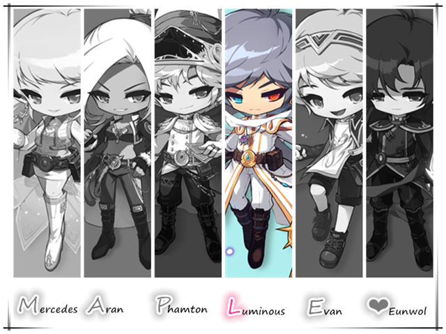
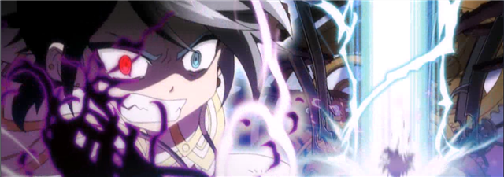
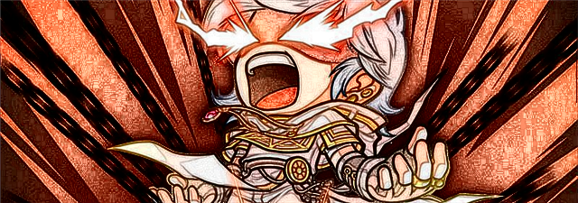
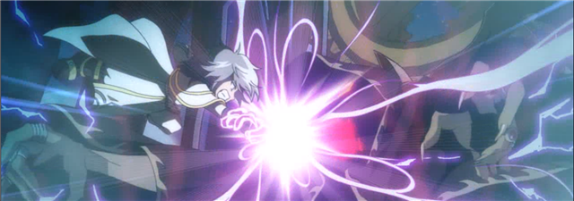
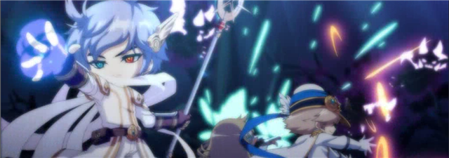
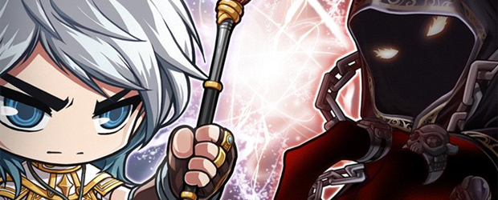

# 夜光法师

> 黑魔法师也是我的另一面……

[[toc]]

- 原帖地址：http://www.kmsfan.com/thread-4732-1-2.html
- 截图采集：白槭
- 资料整理：阿查-查无此人、 咕噜咕噜乐、丨叶枫丨
- 特备鸣谢：Vanguard、阿夕亚

如需转载请务必保留作者信息，注明转自剧情组并附上原帖地址

## 人物信息

**夜光法师（Luminous）**

**所属势力**：英雄团

**武器**：双头杖

**称号**：星之子

**能力**：操纵光明与黑暗

**身份**：黑魔法师遗失的“光之结晶”

## 历史

- 在500多年前的“上古之战”里，在一个由几名流浪英雄组织起来对抗黑魔法师的团队里，其中有一个被称为夜光法师的少年，他自幼被重视成为能战胜黑魔法师的希望，而这场必然的宿命的对决，在时间神殿里一触即发。

- 夜光法师以英雄隐月的“存在”为代价，抽出了黑魔法师的时间之力，配合弗里德的法阵打算将黑魔法师封印起来。封印阵发动期间为了阻止试图挣脱封印的黑魔法师，夜光法师情急之下徒手冲向封印阵压制，但也因此感染了黑魔法师的黑暗力量…

## 人物传记

### 【序章】来自黑暗的警告

- 在封印阵停留的那一瞬间，似乎整个空间都凝固了…

- “别忘了，你体内的黑暗必定会吞噬掉你！”夜光法师听到了这么一句话，来自黑魔法师的警告。

### 【EP1】无法摆脱的黑暗

- 自那场战役结束后，时间已过了数百年之久，在夜光法师的长眠中似乎毫不知情，当他再次醒来的时后，发现自己被传送到了一个小森林中，他苏醒后第一时间仍然想到的是自己的同伴。正当他面对这个陌生的环境的时候，一个小女孩走了过来，她自称拉尼娅，和一只小猫佩妮居住在魔法密林里。夜光法师急切地向她询问关于埃欧雷、黑魔法师的情况，拉尼娅的回答让夜光松了一口气，原来距离封印黑魔法师的那天已经过去了几百年，而且封印成功地实现了，虽然其他伙伴都杳无音讯，但是好在所有的事情都结束了……

- 后来拉妮娅收留了夜光法师，两人在这个隐秘的小森林里安定下来。他们偶尔外出游玩，有时候到河边钓鱼，采果子、打雪仗这些活动丰富了日常的生活，虽然不算富有，但小两口共度了一段幸福美满的时光。

- 光阴似箭，日月如梭，眨眼间数年过去了，两人的身高已经有了明显的成长。某一天，夜光法师正准备购买做饭的材料时，他感觉到最近的剧痛越来越频繁，但他并不知道疼痛的原因，为了不让拉尼娅担心，他选择了隐瞒。今天的天气格外的好，拉尼娅十分有兴致地提出夜光法师回来后去野餐的提议，听到这个，夜光法师多么期盼这样的生活能一直持续下去。正当两人告别之时，夜光法师体内一股庞大而又无法控制的黑暗魔力突然涌现出来，并不断侵蚀着他的意识，夜光法师与不详魔力的挣扎中爆发出的冲击波并伤及了拉尼娅及周围一切。当夜光法师苏醒后，在他的面前只有倒下的拉尼娅和已经被完全破坏的房屋。此时，他才明白黑魔法师最后留下的话的意思，但是黑暗力量依然占据着他的身体，不断肆虐着，为了不再伤及拉尼娅，夜光法师无奈地选择了离开，探寻控制黑暗力量的方法。

### 【EP2】汉斯的指引

- 离开小屋的夜光法师，开始尝试使用自己不曾了解的黑暗力量，但是发现只能释放黑暗力量，却无法很好地控制，深感对未知力量的恐惧。夜光法师决定去周围的城镇了解几百年后的变化。他来到魔法密林，向当地的妖精艾温询问欧罗拉以及上古之战的情况。妖精的回答让他十分失望，除了上古之战和英雄的事迹，其它的消息无人知晓。夜光法师奇怪的询问让本身对人类有隔阂的妖精艾温很不耐烦，无意间刺激了夜光法师体内黑暗力量，使得夜光法师性情大变起来，这样强烈的反差让艾温感到浑身颤抖。幸好夜光法师及时得调整了自己的状态，避免悲剧的发生。他在在妖精艾温的指引下，进入图书馆寻求汉斯的帮助。然而汉斯长老正外出，夜光法师与书童璐璐一同寻找有关的书籍，期间为了压制体内的黑暗力量，夜光法师时不时就要通过打猎来释放力量。终于，璐璐找到带有极光组织纹样的旧卷轴，然而这个卷轴是残缺的，夜光法师内心一凉。正在此时，璐璐不合时宜的催促离开如同艾温的抱怨一样，再次刺激到夜光法师的敏感情绪，受黑暗力量占据的他性格异常暴躁，心狠手辣地把璐璐送到了其它次元。当夜光法师重夺意识后才发觉到自己的错误，于是选择了到野外狩猎来控制黑暗力量与发泄。

- 他重返魔法密林图书馆时，汉斯长老已经回来了。一段不友好的开场，夜光法师抱有歉意地向汉斯解释，体味过黑暗力量的汉斯明白，仿佛这些都是自己过去犯错的惩罚，决定尽力帮助他控制力量，并救回璐璐。汉斯认为以夜光法师现在的力量还无法将璐璐带回，需要进一步控制黑暗的力量，于是提议他继续到野外狩猎以作训练。当夜光法师完成训练回来后，汉斯也找到的欧罗拉相关的情报。打开情报一看，一个残余的灵魂影像出现在夜光法师眼前并自言自语起来， "冰冷的火焰，灼热的湿气，黑暗的光明，明亮的黑暗……” 灵魂影像一番简单的自我说明后，留下了这么一句深奥的话。夜光法师似乎想起- 极光组织的理想是在矛盾中寻求真理……体会过光明和黑暗的力量后觉得这句话的浅显，但要真正理解这句话就要去欧罗拉的根据地- 希利尼提。之后，夜光法师在汉斯的协助下经历几番修炼逐渐能熟练控制自身力量，最终把璐璐从其他次元带回来。离别之际，汉斯给了夜光法师一个能容纳光明力量的重生灯笼，并嘱咐夜光法师要努力控制黑暗的力量，夜光法师道谢后用这个重生灯笼前往了希利尼提。

### 【EP3】超越时光的会面

- 到达希利尼提的夜光见到了以光影形式存在的飞鱼丸，夜光法师散发的黑暗力量让飞鱼丸大吃一惊，飞鱼丸感慨过去的夜光法师已经死去，运用自身残留的光影的力量抗衡，压制其黑暗力量。两人正要交锋之时，拉尼娅的影像突然出现在夜光法师面前，他强行控制力量之后痛苦晕倒。夜光法师清醒后，飞鱼丸向他了解了事情的经过，并告知了自己在进行光明力量的研究中发现的现象，“光明与黑暗间的关系就像硬币的正反面一样”。飞鱼丸认为夜光法师拥有强大的光明力量，就能很容易了解到黑暗的力量。可是现在的夜光法师还不具备完全控制黑暗力量的能力，他于是帮助夜光唤醒了光明的力量，引出了黑暗的力量，暂时压制了黑暗力量的侵蚀。为了避免黑暗力量的反噬，让黑暗力量变成夜光法师的力量，飞鱼丸指引夜光法师修炼自己，寻找老师留下的秘宝，并且给了他一个自由穿梭于希利尼提的三棱镜。

### 【EP4】欧罗拉的秘宝

- 所谓极光组织的秘宝，一般人以及光明力量平庸的人接近秘宝时是没有任何反应的，但是具有优秀光明力量的人接近就会露出本体，先代欧罗拉成员把秘宝放在世界各地，并留下“想要克服黑暗的人，会收集散落的秘宝，揭示光明”这样深刻的含义。在飞鱼丸的指导下，夜光法师展踏上寻找秘宝的修炼之路，游走在枫世界的各地。经历了一系列的探险，夜光法师对这个世界有了重新的认识，也逐渐体会到了，纯粹的光明力量也使人变异，也会被人利用来作恶，作为力量，如果使用不当将会造成恶劣的影响，这也是对过去欧罗拉悲剧的警告。当第六个秘宝展开搜索时，飞鱼丸经过调查也不清楚在什么地方，只留下 “第八个故事蕴含了最后的光明”这样的线索，后来夜光法师来到玩具城赫丽奥斯图书馆寻找管理员威兹来解读这句话。据闻由于玩具城存在时空缝的原因，导致所有的故事书都乱七八糟地扭曲在一起。经过威兹和夜光法师的共同努力终于修复了第八本故事书，当夜光法师触碰到故事书的那一刻，第六个秘宝展现在他眼前，原来第八本故事书是蕴含着光明的水晶，水晶仿佛诉说着，善良的人一定能获胜。

- 遵从先代欧罗拉成员的嘱托，飞鱼丸不仅帮助夜光法师寻找到了被安放在世界各地的秘宝，而且还利用秘宝将夜光法师的光明与黑暗的力量成功结合，将自己多年总结的成果传达给夜光法师- “最黑暗的时候，光芒最盛”，于是受到启示夜光法师开始了操纵黑暗与光明融合的修炼，他对光与暗力量的认识更上了一个新的高度。

### 【EP5】回到她身边

- 觉得自己修成正果的夜光法师突然间很想念拉妮娅，毕竟之前的不辞而别肯定会让人担心，再加上自己长期以来的愧疚，他决定回去看看。就在前往拉妮娅居住处的路上，夜光法师惊讶地发现军团长阿卡伊勒的部下正在魔法密林周围搜索！心中异常挂念拉尼娅，夜光法师加快了前进的脚步。幸好它们未曾发现隐藏在森林深处的小屋，许久未见的两人终于重逢，见到了思念已久的夜光法师，拉尼娅以为出现了幻觉，一时之间悲喜交集。夜光法师为之前伤害了拉尼娅，破坏了心爱的小屋而自责不已，但拉尼娅似乎没有在意他的无心之举，相反对其不知所踪而忧心匆匆，抱怨不已。两个彼此思念的人互相拥抱，那场面无形间散发出一股温暖的光芒……

- 为了维护这重新恢复的幸福生活，为了防止黑魔法师对拉尼娅的觊觎，夜光法师希望自己外出时候能有东西能保护拉尼娅。后来在飞鱼丸的帮助下夜光法师在小森林附近布下了防御结界和守护机械人来照顾拉妮娅，然后自己继续踏上了追寻黑魔法师踪迹的旅程。根据与地球防御本部合作得到的情报，夜光法师了解到了十字旅团这个追踪黑暗怪物的组织，而其中让他最在意的情报是：玩具城的赫丽奥斯图书馆顶楼出现了一个可以通往过去的大门，那个地方有黑魔法师的痕迹。对过去充满谜团的夜光法师，决定前往一探究竟。

### 【EP6】军团长们

- 通过了时间闹钟，夜光法师发现到达的地方竟然是上古之战后的几个月的艾琳森林，经一番探索后在森林深处发现了原本死亡的军团长的古瓦洛。回忆起上古之战当天，古瓦洛在时间神殿拦遭到了麦格纳斯的偷袭，两个军团长的厮杀让他百思不得其解。古瓦洛坦言道：“我是构成这个世界的元素，是不会完全死去的。”更何况古瓦洛乃元素精灵之王，他表示自那一战役后花了很长的时间重新凝聚意志，并发现了自己过去的误区，已经离开了黑魔法师的阵营。古瓦洛更是对夜光法师身上的黑暗力量感到奇怪，留下一句“现在看来，你跟黑魔法师真的很相似，就好像是双胞胎一样”并劝告夜光法师离开……

- 过了一段时间，夜光法师再次收到情报并前往了位于冰封雪域的狮子城堡。他在这里展开了一系列的探索，了解到军团长班雷昂悲惨的过去，虽然班雷昂以往有“狮子王”之霸称，但在夜光法师看来，他也只不过是沉浸在失去妻子的悲伤中的愚蠢男人罢了。

- 不过有一点确信的是- 军团长们的联系四散五裂，前有麦格纳斯背叛撤退，后有古瓦洛重生悔改，今有班雷昂独守空城……后来夜光法师受到了希纳斯女皇的邀请，得知了冒险岛联盟的存在，为了共同对抗黑魔法师，他决定加入联盟军，与过去的战友一同守护这个世界。

### 【EP7】惊人的身世

- 不久后，飞鱼丸偶然在翻阅古书的时候发现了终极秘宝的下落。夜光法师在飞鱼丸的指导下前往黄金寺院寻找欧罗拉的终极秘宝。当他探索到黄金寺院的尽头时，一个经历风霜的残影出现在夜光法师面前，那个残影万分感慨，并向夜光法师讲述了几百年前封尘的秘密- 夜光法师是黑魔法师将体内遗留的光明力量还有自己具有人性的部分一同分离出来的结果，原本这个光明结晶会逐渐消散，但是欧罗拉的大家用光明的力量使得这个光明的结晶能在遥远的未来重生。夜光法师听完这些话就明白了这个残影是极光组织的第二代掌门马尔斯......从中还得知自己的导师- 露西娅为保全大局成为牺牲品的事情。在向马尔斯道谢后，完成了使命的马尔斯看着夜光法师心满意足地向他道别，摆脱了无尽的生命回到宁静的安息中去。夜光法师回到希利尼提后把导师的话转述给飞鱼丸，听到了导师留下的遗言，飞鱼丸也陷入了沉默。

### 【EP8】露西娅?拉尼娅?- 再会黑魔法师

- 夜光法师正处于对突如其来的真相的迷惘中时，突然接到地球防御本部的工作人员M的情报，发现了黑魔法师德踪迹，但是地点在拉尼娅家的附近。夜光法师急忙赶回了家，飞鱼丸无奈告知他拉尼娅被黑魔法师带走了。一路追寻后，夜光见到的是已经被黑魔法师控制的拉尼娅，被控制的拉尼娅奉命要消灭夜光。一场痛苦的交战后，附在拉尼娅的黑暗力量被驱散，此时黑魔法师的幻象出现在夜光法师眼前，“能感觉到被情这种东西左右的脆弱的心”黑魔法师一句这样的话讽刺了夜光法师的现况，但正因为这句话更是燃烧起他的斗志。“感情不会使人软弱，反而会更坚定意志”夜光法师如此回应。两人的对话中可以感受到强烈的杀气一触即发，但由于黑魔法师的力量还没有完全恢复，在短暂对话后便纵然消失。由此，黑魔法师的回归被正式确认。因为黑魔法师的力量的冲击使拉尼娅作为“露西娅”时的记忆开始逐渐恢复，拉尼娅突然提起以前在希利尼提的事情，夜光法师明恍然大悟- 原来拉尼娅就是露西娅的转生。跨越数百年的分离，自己尊敬的导师、自己曾经喜欢的人原来一直在身边，夜光法师突然间笑颜如花，感叹命运的安排。

- 一切又恢复了平静，但是夜光法师知道，黑魔法师对冒险岛世界的阴影依旧笼罩着，为了守护拉尼娅，为了守护冒险岛世界，重拾过去英雄的誓言，自己还有更多的事情要去做，对抗黑魔法的征程仍在继续……

## 相关介绍

### 欧罗拉

- 极光组织欧罗拉是“白魔法师”游走世界后为了追求极光而建立的组织，他追求极光想要用现在混沌的世界作为祭礼创造一个新的世界:“存在于地平线那边的无限的知识。能够使我们更完美，能够在我们所居住的这个世界，再现神的城市的本源的智慧…”。极光组织初代掌门被大家尊称为大师，众多学者追随着他在静谧之林深处建造了极光大神殿，共同对光明进行研究，由于初代掌门认为只有在终极黑暗中才能寻找到终极光明，因此选择在几乎不能见到太阳的静谧之林建造了极光大神殿，这也体现出了初代掌门对自己的理念强烈的执着。

- 当初代掌门堕落成“黑魔法师”后，欧罗拉的成员遭到他的追杀死伤惨重，由成员马尔斯挺身而出成为第二代掌门，艰难地把这个组织维持下去，目的是将“星之子”抚养长大，将战胜黑魔法师的重任交给了他。

### 极光组织的六个秘宝

- 欧罗拉的秘宝蕴含了最纯粹的光明因素，每一个都蕴藏着巨大的光明力量，是极光组织的智慧结晶。初代欧罗拉成员将众多秘宝散布在世界各地，希望能用光明的力量帮助有需要的群众。由于秘宝的力量难以控制，稍有不慎就会被坏人利用起来，只要适当运用才会发挥秘宝的本能。而飞鱼丸则是运用众多秘宝的力量，帮助夜光法师客服了黑暗力量的侵蚀，并将两种力量融合在一起，实现光明力量与黑暗力量的平衡操纵。

- 第一个秘宝在妖精学院里，秘宝导致地鼠王变异；第二个秘宝在金沙滩，导致黑水灵变异，影响金沙滩度假村的运营；第三个秘宝在废弃都市，由历代黑暗领主达克鲁保管；第四个秘宝在列娜海峡，被黑色之翼利用从而引发列娜海峡的危机；第五个秘宝由林中之城的一个武士家族世代保管；第六个秘宝隐藏在赫丽奥斯图书馆的第八本童话书里；终极秘宝在黄金寺院的尽头，导致了寺院内的动物暴躁起来，严重影响了营业。

### 光明超越者“黑魔法师”

- 他是知道了世界背后真相的人，他是极光组织欧罗拉的初代掌门，他是探索光明力量的组织欧罗拉的创始人。他知识渊博，年纪轻轻就拥有非凡的魔法造诣，几十年间，他带着一根法杖，孤身游荡世界。疯狂地写书、帮助他人，留下了无数的故事，世人称他为“白魔法师”。

- 他非常渴望极光，但是没有黑暗的地方光明也会失去力量，为了追求魔法的顶端，探究极暗中的极光，他从光明的反面- 黑暗中寻找极光，在对于光明的研究感到绝望、迷失了自己的意志，从而被黑暗力量所侵蚀，变成一个对黑暗充满渴望的怪物。

## 特殊专栏- “星之子”

### 关于拉妮娅与露西娅

- 露西娅是夜光法师在欧罗拉组织时期的同门师姐兼导师，在夜光法师印象中是一个温柔而又坚强的大姐姐，并视她为偶像。露西娅自幼实力出众，比其他人都亲近光之力量，她肩负着欧罗拉的重任被组织精心培养长大。星之子成功诞生后并取名为“Luminous”并选择了露西娅作为夜光法师的替代品，以导师的身份开始教导其使用光之力量，原欧罗拉组织基层成员飞鱼丸则作为夜光法师的师弟与其一同接受教导。后来露西娅按照欧罗拉的原计划被黑魔法师杀死，在欧罗拉的祈祷下获得转生。

- 拉尼娅是夜光法师醒来后遇到的女孩，她陪伴夜光法师居住在一起数年，两人相依为命，度过一段美好的童年。虽然年龄比夜光法师小，却十分精通家务，甚至反过来还照顾了夜光法师的日常饮食。当夜光法师知晓拉尼娅的身世后，夜光法师决定尽全力守护她，算是偿还拉尼娅转生前的牺牲和付出。虽然是守护的关系，但两人依旧有良好的感情。

- 拉尼娅是露西娅的转生，与夜光法师的邂逅乃命运之红线。

### 星之子的真相

- 欧罗拉是一个由初代掌门白魔法师组织成立的研究光明力量的集团，但是光明的力量远比他们想象的要深奥很多，而白魔法师在长时间研究无望后就从光明的反面，黑暗中寻找极光的线索，却在对于光明的追求的道路上迷失，被黑暗的力量吞噬，却留下了遗失的最为纯粹的光明结晶，也就是后来的星之子- 夜光法师。

- 根据次元图书馆第一本书的记载，夜光法师是当时被佣兵找到的光明结晶，准确的说是白魔法师黑化暴走后将体内遗留的光明气息还有自己具有人性的部分一同分离出来的结果。原本这道光芒会逐渐消散，但是欧罗拉的研究者们利用光明的力量使得这个光之结晶化身为了夜光法师，正如黑暗的力量来源与光明一样，黑魔法师的邪恶的力量来源于夜光法师善良纯粹的心性。由于当时黑魔法师受重伤后意识到遗失的光明的结晶并没有来得及毁灭，所以得知欧罗拉救下夜光法师后一直带有戒心，只要看到类似星之子的人，黑魔法师就会毫不留情的将其杀死。

（以下文字出自NPC原话，虽然字数篇幅略长但优点是详细描述了整个过程，笔者采用剧情原话是让读者更直接地理解这个真相。）

- 在不知你什么时候才会重生的情况下，我们必须下决定。以当时欧罗拉的力量，只能勉强抵抗受重伤的黑魔法师，要是黑魔法师复原后再次进攻欧罗拉，结果不堪设想！为了对付他，我们制定了两种方案。一种是将据点移动到现在的安身之所，在现实世界分离的独立的次元空间里建立特殊的光明结界，进行双重防备。但是黑魔法师的力量难以预测，所以我们准备的第二套方案，就是找一个替代品。我们自知无法抵御黑魔法师的袭击，所以我们找了一个比其他人实力更加出众，能亲近光明力量的人，精心培养她长大。

- 而那个“她”，正是露西娅。

## 能力相关

### 职业亮点

- 夜光法师的技能大致分为三种类型，光明系技能，黑暗系技能，还有光明与黑暗的平衡技能。

- 在光明模式下可以提升自己的洞察能力，光明系的魔法具有超远的半径的传播范围和强力的贯穿能力两大特性，可以将光之力集结于双头杖的一端射出密集的光束之箭攻击强敌，也能以自身为中心闪爆光能量振飞周围敌人并让其陷入短暂眩晕，同时自己也能化身为光束进行一定距离的瞬身移动。而黑暗魔法具有可怕的精神污染和物理侵蚀力，可以更加轻易的开启异次元空间，在攻击中附着上黑魔法可以让敌人受到成倍的伤害，而平衡模式下则可以综合光明魔法与黑暗魔法的优点，凝聚出更加强大的魔力。

### 技能分类

#### 光系技能

- 闪电反击	向对方发射强烈的光速，光束击中敌人就会分散，反射到周围敌人身上
- 超级光谱	短时间内连续发射出无数股强大的光束地图炮，并可以大幅度调整方向
- 闪耀救赎	运用光明之力治愈队友，同时召唤出来的光明法杖能对敌人造成伤害

#### 暗系技能

- 启示录	开启黑暗的缝隙，召唤燃烧的地狱之火，展开大规模的炼狱
- 虚空重压	召唤蕴藏黑暗力量的能量球，炼狱的球体对敌人造成巨大伤害
- 暗锁冲击	从敌人所在的位置拉出地狱锁枪，从下方展开攻击

#### 平衡技能

- 绝对死亡	将光明与黑暗的魔力融合起来化作一把锋利剑器，从天而降造成巨大的伤害
- 死亡之刃	同时召唤出代表光明与黑暗的两个死神，一同挥起大镰刀砍向敌人
- 晨星坠落	召唤燃烧的流星球砸向敌人，流星球滚动轨迹中造成持续性伤害

## 对战记录

交战对手 |	结果 |	备注
----------|--------|----------
麦格纳斯 | 中断 | 夜光法师的攻击对吸收古瓦洛力量的麦格纳斯毫发无损，目的达成的麦格纳斯从容离开
黑魔法师 | 胜 | 与其他5名英雄合力将其封印
拉妮娅 | 胜 | 忍痛打倒被黑魔法师操控的拉尼娅

## 经典录语

### 夜光法师

1. 你来晚了，即使是世界上最棒的怪盗，也无法偷取时间啊。
（开战前遇到撤离的幻影，很讽刺同样也是寓意深刻的一句话。）

2. 黑魔法师，和我一起同归于尽吧！
（抱着必死的决心将黑魔法师推回封印阵）

3. 为了一个小破孩，你不要老命了吗？
（初期被黑暗力量腐蚀的夜光，一句反常的话脱口而出，令汉斯大吃一惊）

4. 我保证，再也不会丢下你一个人。

5. 在最后的瞬间，他把我分离出来。在他自己身上剩下的那非常小的一丝光明。在我消失的他，成为了真正的“极暗”。光明的地方就有黑暗，没有黑暗的地方，光明便会失去力量。从黑暗中被分离出来的我，将会慢慢消失。但是如果有机会的话，我的希望变成机会的话……希望拥有着这光明的力量的我能够照亮黑魔法师的黑暗……
(夜光法师在经历了一切，知道了所有的事情后的真切的愿望...)

6. 黑魔法师也是我的另一面……
（这句话内心里充满了无奈与痛苦）

7. 露西娅是过去和我一起学习光之力量的人。她既是我的偶像，也是我喜欢的人。
（在拉尼娅面前表达出对自己导师的怀念之情）

自幼被欧罗拉重视的他，被组织视为能战胜、超越黑魔法师的存在，从小就肩负着这样的重任成长起来，长大后亦不负众望，“夜光法师”这个荣耀的称号就是自己努力修炼的肯定。他性格温和内心善良向往和平，自尊心极强，是个慢热有耐心的家伙，最喜欢看书以及研究魔法。他的说法方式有内涵一针见血，也因此在团队中经常跟吊儿郎当的怪盗幻影闹不和，但他们两人强烈的性格反差得到绝大部分玩家的喜爱与狂热支持。

### 拉尼娅

1. 你又忘了！织毛衣用的毛线。必须在天气变冷之前，织好衣服和围巾。
（对夜光法师的照顾无微不至）

2. 嗯，如果你回来得太晚，我就不给你开门哦。

3. 夜光法师，我一直在等你，从未放弃过，那数不清的漫长岁月......
(拉尼娅在夜光法师离去后非常的担心，可见拉尼娅在童年期间已经对夜光法师留下深刻的感情。)

4. 夜光法师，你还记不记得以前在希利尼提的小房子里偷吃点心挨训的事？还记得你第一次使用光之力量那时的情景吗？那时你在我面前兴奋地炫耀了好一会儿呢。那模样实在太可爱，我还忍不住摸了摸你的头呢。
（恢复露西娅的记忆后，展现出一副成熟的长辈气质，她的身份亦妹亦师，令到夜光法师一时之间欣喜交集。可谓大团圆结局。）

拉尼娅心地善良、单纯可爱，在夜光法师的陪伴下度过美好的童年，长大后更是知书达理善解人意，对夜光法师无微不至，视他为很重要的人，也是唯一能“驯服”夜光法师的人，乃贤妻良母之典范。

## 扩展阅读

【剧情小组】寻求光明却迷失于黑暗 黑魔法师深度解析：
http://www.kmsfan.com/thread-4733-1-1.html

【剧情小组】第4英雄 怪盗幻影剧情全介绍：
http://www.kmsfan.com/thread-4729-1-2.html
