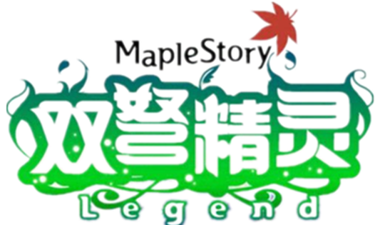
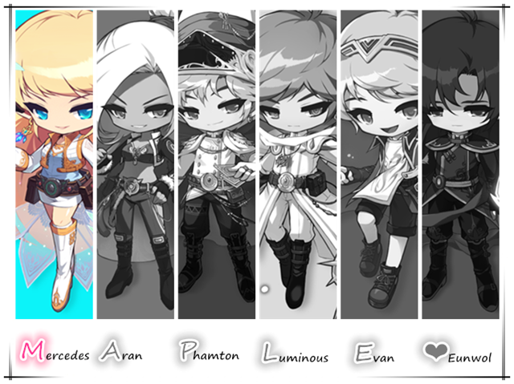
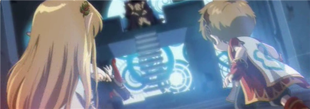
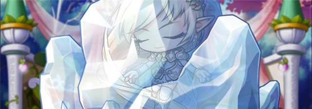
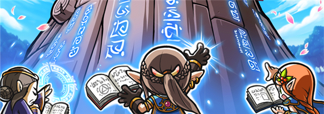
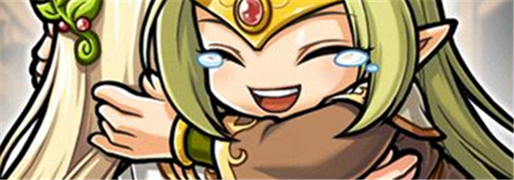
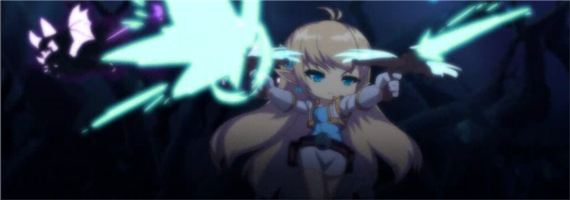

# 双弩精灵

> 愿精灵之祝福与你同在。

**作者：[丨叶枫丨](https://tieba.baidu.com/home/main?un=丨叶枫丨)，木木**

[[toc]]

## 人物信息

**双弩精灵（Mercedes）**

**所属势力**：英雄团

**武器**：双弩枪

**称号**：精灵之王

**能力**：魔法箭矢、行进连击

**身份**：埃欧雷国王

## 历史

- 在500年前黑魔法师动荡整个世界的乱战里，双弩精灵作为埃欧雷的最强者和国王，为了保护自己的国家，她跟随几名流浪英雄站出来对抗黑魔法师，并展开了巅峰的对决，后人把这场战争称之为“上古之战”。

- 虽然黑魔法师被封印起来，但是英雄们无一幸免遭其诅咒，身为精灵之王的她更是连累到整个精灵种族以及村子被冰封起来。在这冰封的期间人们甚至以为精灵一族已经灭亡，但随着黑魔法师即将复活的气息越来越浓厚，这位高贵的精灵之王也从冰块中缓缓苏醒……

## 人物传记

### 【序章】 黑暗的诅咒

- 在那场大战中虽然黑魔法师被封印下来，但是因为他最后使用的魔法引起了大爆炸，令到所有东西都分崩离析，其他英雄们都被炸开了。双弩精灵在昏迷之中醒来后遇到身受重伤的龙神弗里德及阿弗利埃，得知全部英雄们都被黑魔法师施下诅咒，她考虑到自己身为精灵之王的身份，对她的诅咒就等于对整个精灵族的诅咒，双弩精灵带着不安的心情赶回埃欧雷。

- 双弩精灵为动荡的世界挺身而出的做法得到各位长老们包容并理解，然后她用最后的力量为村子设下魔法结界作为保护，与全部精灵一样，渐渐伴随诅咒缓缓进入冰封状态……

### 【EP1】精灵的苏醒

- 在很久很久后的某一天，双弩精灵慢慢睁开眼睛苏醒了，一切都仿佛发生在昨天。

- 但双弩精灵四周观察后发现长老和其他精灵们依然在冰封中沉睡着，能醒来的就她一个，并且还感觉到肮脏的气息在徘徊，就连能持续100年的结界也消失了。在感觉奇怪之余双弩精灵还发现自身的等级居然变成10级了！吓得她失去理智地大叫起来。经过冷静的分析总结出两点- 黑魔法师的诅咒并没有消失、黑魔法师的封印变弱了。在修炼场一番热身后也发现无论是怪物还是这个世界有了很大的变化，抱着对未知新世界的种种疑问，双弩精灵决定踏出一步走到外面的地方一探究竟。

### 【EP2】陌生的世界

- 从埃欧雷走出来的双弩精灵踏入一个茂密而又繁华的森林村庄，高耸入云的古木、独具匠心的木屋、人类与妖精混居的生活方式给她耳目一新的感觉，不得不怀疑自己到底沉睡了多长时间。

- 后来在一个叫维英的木灵身上询问得知，精灵族已经在几百年前就已经消失，甚至还被人们遗忘了。这样荒谬的说法让双弩精灵一时之间难以置信，于是再去询问更年长的妖精艾温，艾温依然保持了同样的说法，至于精灵消失的原因，历史的记载相当模糊……但双弩精灵依然无法相信，继续询问下去，在指引下找到妖精罗雯，得知现在的妖精只剩下魔法密林的木灵和天空之城的仙灵。面对岁月的流逝、历史的遗忘，再加上自身消失的力量，双弩精灵感到压力重重略显失落，罗雯为了让她清醒一下头脑介绍到村外一颗会说话的树那里喝点清澈的树液。双弩精灵和那棵树闲聊了自己的过去，那棵树不但没有安慰到双弩精灵，更是建议她安静地渡过平凡的日子，其中一句“既然你说没有力量，那就别多管闲事，好好地生活吧。”的话反而燃烧起双弩精灵的斗志，在那棵树的教训下她终于清醒起来了，双弩精灵决定重新振作，为了还在冰封中的埃欧雷！为了将臣民在诅咒中解救出来！

- 这一刻，精灵之王的威严在闪耀，这种光芒让人感觉到炽热的意志。

### 【EP3】让国王去跑腿？

- 在介绍下双弩精灵去到魔法密林的生物学家巴缇身边当助手协助调查，虽然要一国之王干这种工作实在有失身份，但她也觉得这是了解这个世界最好最快捷的办法。于是双弩精灵开始了生物调查的协助工作，也了解到火独眼兽这种怪物在数百年来比以前变弱了很多，而且头一次听到有风独眼兽这种怪物的存在。正在巴缇思考这两种怪物的始祖方向时，双弩精灵凭借精灵拥有惊人的岁数以及敏锐的直觉向巴缇讲述了自己的意见，得到巴缇的认同，大赞双弩精灵这种假设既独特又合理。完成独眼兽的研究后巴缇又把她介绍到勇士部落的芳博士那边协助研究，对于双弩精灵来说，勇士部落这个名字完全是陌生的，用她的原话就是：“那里过去是无人的山岩地区……”

- 经一番探索下双弩精灵终于找到芳博士并开始钢甲猪的研究工作。虽然有双弩精灵的协助，但芳博士的研究依然遇到瓶颈，手头上的化石与钢甲猪的腿骨对比之下也无法分辨出始祖。因为以前这里是一片荒岩，妖精几乎不会来这种地方，即使是漫长的岁数也无法给到芳博士有建设性的意见。但是后来她从埃欧雷图书馆里带来了古代怪物图鉴送给芳博士，助他找到了研究的方向。见到芳博士欣喜的样子，前段时间还是闷闷不乐的双弩精灵倍感欣慰，因为自己漫长的岁数以及丰富的狩猎经验能给人类献出帮助，这一刻她的斗志无比高涨。接着又经介绍双弩精灵来到射手村的学者布鲁斯身边协助，在研究古代蘑菇方面给到很大的帮助，正是结束射手村的行程时，双弩精灵听到了熟悉的声音…

- 那个声音正是埃欧雷的魔法长老，菲利乌斯。

### 【EP4】数百年的重逢

- 双弩精灵立即赶回埃欧雷，并向菲利乌斯讲述了从冰封里醒来以及为了解开大家的诅咒不断努力修炼的情况。菲利乌斯是魔法长老，根据他的判断是诅咒出现了裂痕，所以双弩精灵才会醒来，但诅咒仍然存在，不过只要精灵之王不断变得更强，就代表整个精灵族的力量会变强。之后，战斗长老迪纳卡和生活长老阿斯迪拉也相继醒来，于是三位长老一起使用灵魂共鸣的魔法“纯白净化”试图解开黑魔法师的诅咒，但遗憾没有效果。菲利乌斯的结论是这并非纯白净化起不到作用，而是黑魔法师的力量在逐渐增强，封印也在相反地削弱，黑魔法师的魔爪将会重新席卷这个世界！

- 就在这时，菲利乌斯提起了一个被遗忘的名字，那是双弩精灵在大战前夕把宝物银槲之剑交由保管的少女，她的名字就叫- 赫丽娜！既然那个少女带着银槲之剑，肯定还会生活在这世界的某个角落！

### 【EP5】再会赫丽娜

- 带着这种信念双弩精灵找到了巴缇询问，在指引之下来到射手村的弓手培养中心见到了赫丽娜。跨越数百年的思念，两人互相拥抱，同伴之间的牵挂使她们欣喜交集。赫丽娜向双弩精灵讲述了避难后在艾琳逼降、建设村庄、开垦金银岛，包括凯琳出走、骑士团建立、黑色之翼作乱、军团长登场等一系列的故事，在赫丽娜的叙述中还提到过战神的字眼，得知战神因为诅咒的原因丧失记忆和能力，但依然独自跟黑色之翼对抗……

- 经一番闲聊后赫丽娜打算回去家乡埃欧雷看看，探访其他同伴。

### 【EP6】黑色之翼现身

- 正是赫丽娜回头拿东西之时，在门外的双弩精灵突然遇到神秘人的袭击，那个少年身披长袍半遮面，手中操纵的木偶向双弩精灵动粗动武，几番较量之下被痛扁慌忙而逃。后来赫丽娜向双弩精灵讲述了黑色之翼这个邪恶组织在金银岛作乱的事迹，估计这次的偷袭其目标正是夺走银槲之剑！意识到黑色之翼的猖獗，赫丽娜生怕会连累到埃欧雷，于是两人立即回城查看。果真，在埃欧雷门外已经聚集了一批黑色之翼的偷袭部准备发动进攻，双弩精灵愤怒地上前扫荡，不费吹灰之力就将整个小队击退了。

- 赫丽娜跟埃欧雷的同伴叙旧后仍然有一丝担心，估计黑色之翼已经摸清了这里的情报，知道村庄缺乏战斗力就会随时来偷袭，于是建议向圣地的骑士团请求支援并合作。后来双弩执意要亲自去一趟圣地，想亲眼确认一下传说中那位新世界的皇帝。

### 【EP7】与骑士团合作

- 在圣地，双弩精灵受到骑士团的隆重接待，并晋见了现任皇帝希纳斯。在两人的交谈中，希纳斯对双弩精灵在“上古之战”的战绩给予崇高的敬意，了解到埃欧雷的现状，表示愿意向精灵族提供能力范围的一切帮助。希纳斯很礼貌端庄地向双弩精灵传达着骑士团对和平与共荣的向往，其中一句“希望能和我这个渺小的后辈分享对抗黑魔法师的力量和智慧……以及守护冒险岛世界的经验。”更是表达出希纳斯对精灵之王的敬意以及圣地骑士团的谦虚。

- 开初双弩精灵得知现任皇帝是个稚嫩的少女时仍保留了一番质疑，觉得希纳斯肩负了太多的重任而导致心事重重，后来在谋士南哈特以及赫丽娜的开解下见识到希纳斯一直以来的坚强意志，开怀地认同了骑士团的力量。

### 【EP8】不速之客

- 经过一段时间的修炼，生活长老阿斯迪拉突然联系了双弩精灵，称流经村庄的泉水突然变得非常脏，这是一件很不寻常的事。后来双弩精灵亲自前往水源的位置查看，发现黑色之翼居然在打水源的主意！三五成群的黑衣人正鬼鬼祟祟地污染源头，双弩精灵十分愤怒，一举歼灭了这里的残党，并且在魔法密林的最深处找到了干净的水源来净化，这次风浪才得以平缓。

- 不久之后，双弩精灵突然收到一份无署名的挑战书，书信中用端正的字体写着，并郑重地向双弩精灵发出挑战。虽然不清楚来者何人，但对于高贵的精灵之王来说逃避挑战是一件非常羞耻的事，接受了挑战的双弩精灵向林中之城进发。神秘人对双弩精灵的双弩枪技术表示敬重，然后端庄地摆出攻击的姿势，两人随即打起针锋相对的较量，箭矢与刀剑碰撞的火花中透露出绝不退让的战意，几个回合之后，在双弩精灵的猛攻压制下神秘人意识到力量的差距，甘拜下风，然后瞬间消失在林中之城的树梢之中……后来经过双弩精灵的亲自调查，得知这名神秘人确是黑色之翼的成员，但是向精灵之王宣战并不是黑色之翼的命令，他是违抗命令发出挑战的。

- 又过了一段时间，双弩精灵接到赫丽娜的信件，让她去玩具城与指导唤醒精灵的人见面，双弩精灵在喜悦之余同时也感觉到信件语气上的奇怪，但并没过多考虑。在玩具城的时间塔入口处，一名叫红茶身穿长袍的男人指引双弩精灵前往时间之路，去寻找能燃尽任何诅咒的“重生火焰”。当双弩精灵来到红茶所说的地点后，突然遇到黑色之翼成员塔高斯的伏击，称重生火焰是伪造的，是为了欺骗她来到这里的陷阱，语气中夹杂着对精灵之王的轻视与侮辱。双弩精灵十分生气，动起真格对塔高斯实施严厉的教训以还颜色，把他打得落花流水仓皇逃窜。经过这一系列的扰乱双弩精灵对黑色之翼的行动再度担心，她向赫丽娜倾诉了自己的想法，虽然这次的目标是她自己，但也是从中有人向赫丽娜抹黑，决定今后多多提高警惕。

### 【EP9】黑暗主宰奥尔卡

- 然而黑色之翼并没有这样轻易放过双弩精灵，某一天，黑色之翼的成员乔庄成双弩精灵的样子带走了埃欧雷的精灵孩子，并发出威胁信要求前往埃德尔斯坦的莱班矿山面谈。明知是个陷阱，但精灵之王不可能放任自己的臣民不管，她二话不说就向埃德尔斯坦进发。在黑色之翼的本部双弩精灵遭受到敌人种种欺诈与玩弄，但这没有阻挡她前进的道路，后来在一个隐蔽的房间里，她遇到了黑魔法师旗下的军团长- 黑暗主宰奥尔卡。奥尔卡承认了她正是黑色之翼的首领，并率直地表示一直以来的滋扰都是她的安排，闲聊了几句后，奥尔卡开始对双弩精灵发动攻击。狭窄的房间里瞬间变成了战场，军团长的力量并非浪得虚名，面对奥尔卡各种棘手的魔法秘术与防御结界让双弩精灵吃了不少苦头，她施尽各种技能浑身解数，并找到了奥尔卡的要害点一举将其击败，最终反败为胜。受伤的奥尔卡意识到形势不妙马上撤退了，并将精灵的孩子安好归还。双弩精灵并没有因为这次侥幸的胜利而自豪，更多的是对未知力量的不安，虽然孩子的诅咒被解开了，但不知黑色之翼从中做了什么手脚。回到埃欧雷后，双弩精灵向菲利乌斯和赫丽娜传达了自己的想法，并加强了村庄的警戒。

### 【EP10】联盟- 大陆会议

- 很快地，双弩精灵受到了骑士团郑重的道歉，这次事件中骑士团认为是派遣队的失责从而酿成此等动乱。在圣地，南哈特由衷地向双弩精灵致歉，表示对这次的过失高度重视并恳请对派遣队的原谅，希望不会给骑士团和埃欧雷的友谊产生不良的影响。同时双弩精灵也表示谅解与包容，后来接受了骑士团的贵重礼物以示再续友谊。

- 又过了一段时间的修炼，双弩精灵再次接到南哈特的邀请，称女皇正在做在一个重要的决定，希望能听听身为精灵之王的意见。在圣地，希纳斯亲自接待了双弩精灵，两人围绕枫世界的近况展开讨论- 随着黑魔法师复活的气息越来越浓厚，加上兴风作浪的黑色之翼、逐一现身的军团长让骑士团感到困惑与不安，单靠他们的力量是无法抗衡的，希纳斯表示结集所有的势力的力量来对抗共同的敌人，那就是组建联盟。双弩精灵感到小意外，但从希纳斯的语气中看得出她坚定的决心，表示认同并支持。

- 不久之后，双弩精灵受邀参加了在圣地召开的“大陆会议”，联盟的建立受到各方势力的共同支持，为了实现各自的理想和自由，希纳斯女皇与反抗者代表吉格蒙特、冒险家代表赫丽娜手牵手团结一体，象征联盟的成立。会议上双弩精灵接受了希纳斯女皇的觉醒仪式并获赏象征联盟一员的勋章一枚。

### 【EP11】战斗仍在继续

- 经历了漫长的修炼，在某一天“伟大的精神”突然召唤了双弩精灵，称对其精灵之王的力量表示最终的承认，然而埃欧雷的部分村民并未完全苏醒，战斗仍在继续，寄望双弩精灵弘扬精灵族高贵、崇尚和平的精神，将百姓从黑魔法师的困境中解救出来。

## 相关介绍

### 埃欧雷
- 精灵之乡埃欧雷是精灵群居的地方，位于维多利亚岛（现称金银岛）东部茂密的森林区域，精确坐标是现今魔法密林的东北方，是精灵的发源地，也可以说是最原始的魔法密林。上古之战结束之际，双弩精灵为埃欧雷设下魔法结界后伴随诅咒进入冰封状态，使得这个村子与世隔绝起来，渐渐地人们甚至已经遗忘了这个村落与种族。

- 埃欧雷由精灵之王统治并有三位长老辅助管理，国王代表整个精灵族，而国王的一举一动都会对精灵族有影响。村子的中央有一棵用于施展魔法的樱花树，并设有图书馆、音乐厅、训练场等娱乐场所，村子外围有清澈的泉水环绕流淌，而国王的养居则深处村子内部。得益于数百年来的“保鲜”，这里保存了最为原始的森林环境，清新的空气、澄莹的泉水、魔幻多彩的植物，给人一种心旷神怡的感觉，安静得来倍感舒适。

### 妖精的种类
- 妖精在冒险岛的世界中是一种具备智慧与力量的高等种族，其高贵的血统甚至能超越人类与龙族，用“天生丽质”来形容是最为恰当。妖精的生命力十分顽强，其寿命长度是人类的12倍之多，可谓贯众整个冒险岛世界的观察者；我们熟知的冒险家弓箭手教官赫丽娜正是妖精种族，从上古之战到现在都有她的故事，至今仍然能保持一副成熟的御姐气质，这种寿命只能用可怕来形容。

- 目前妖精的种类大致有三种，分别是木灵、仙灵和精灵。

- 木灵，现居魔法密林，特征是尖耳朵、长着半透明的翅膀，性格孤僻傲慢、不喜欢群居。自从汉斯当上魔法密林的长老后提倡人类与妖精混居，两个种族建立和平共处的友好关系，仙灵才得以慢慢接纳人类；但仍有一部分的仙灵无法适应人类的生存方式而退避到森林深处，比较出名的群居点有艾利涅，他们自立组织起妖精学院并设下魔法拒绝人类进入，依然保持着“禁止与弱小的人类接触”等封建的传统。

- 仙灵，现居天空之城，特征是样貌接近人类、长着厚壮的翅膀。性格和蔼可亲、平易近人。很久很久以前维多利亚岛（现金银岛）与奥西利亚岛（现天空之城）本来是相连一起的大陆，在上古之战的动荡中造成大陆板块断裂，一部分妖精跟随这个大陆浮升到天空中，经历数百年的独自繁衍从而进化成现在的仙灵，与人类共同生活在天空之城，有的仙灵甚至是人类与妖精的混血种，所以具备了两个种族的优点，比木灵更知性，视人类为朋友。

- 精灵，现居埃欧雷，特征是尖耳朵、没有翅膀、皮肤白皙光滑，性格爽朗豁达、成熟理智。精灵是妖精当中战斗力最强的，其血统也最为纯正，在妖精中拥有高贵的地位。由于上古之战整个种族遭到诅咒而被冰封起来，渐渐淡出人们的视线当中，甚至被认定精灵族已经灭绝。精灵在自己的种群中有成熟完善的管理机构，于是便有了国王、长老等权力；国王的力量由“古代精灵伟大的精神”赐予并认定，而“伟大的精神”并不是普通人都能见到的，引用剧情原句的自述- “我的肉体已经像尘土一样消失，只剩下精神。几百上千年的时间，对于我来说就是像流水一样。”可见精灵这个种族历史的经年累月、深远长留。

### 银槲之剑
- 银槲之剑是精灵族一件十分贵重的宝物，是权力与高贵的象征，它有着“防御一切诅咒”的能力。当年与黑魔法师最终决战的前夕，精灵之王安排了赫丽娜跟随其他岛民去避难，为了确保赫丽娜的安危就把宝物银槲之剑交由她保管，于是她平安地躲过了黑魔法师的诅咒生活着，后来成为金银岛家喻户晓的大英雄。

## 对战记录

交战对手 |	结果 |	备注
----------|--------|----------
黑魔法师 | 胜 | 与龙神弗里德一同将其重创，以助封印的顺利启动
弗朗西斯 | 胜 | 遇到袭击将其痛扁教训
偷袭小队 | 胜 | 愤怒击退入侵埃欧雷的黑色之翼爪牙
黑翼残党 | 胜 | 将污染水源的残党歼灭
影子武士 | 胜 | 受到邀请切磋武艺
塔高斯 | 胜 | 受到欺骗与侮辱，将其重打教训
奥尔卡 | 险胜 | 面对军团长级别的实力陷入苦战，最终反败为胜

## 经典录语

1. 国王的词典里没有放弃两个字！

2. 不！我没有那么弱！我不是10级！不是！
尽管实力在慢慢恢复，但嘴上十分在意自己的力量。）

3. ……嗯？你是谁？小孩子找我干…什么…？
（对付熊孩子就用年龄压制，唯独精灵族能有这样的自豪。）

4. 240岁，真是花一般的年龄。

5. 对于高贵的精灵之王来说，逃避挑战是非常羞耻的事情，想挑战就尽管来吧！

6. 经过了几百年，我还是害怕那个人……很丢脸吧……
（对于这个国王来说，自尊心还是很强的。）

7. 所以我支持你，女皇。
（一句简简单单的声援给了希纳斯巨大的精神支柱，无形间推动了联盟的建立。）

8. 愿精灵之祝福与你同在。

9. 其他人都会没事的，因为大家都很强壮！但是我担心弗里德……那个家伙，体力本来就很弱。
（醒来后最在意那个体弱的家伙，展现出一副可靠的长辈气质。）

出身高贵血统的她，自幼习得举止文雅、知书识礼的品行，为人娴雅大方、成熟理智，但偶尔有冒失的一面，暴躁起来的话就会非常固执，厨艺方面比较糟糕。在团队中是个可靠的长辈，作为精灵之王她自尊心极强，很在意自己的能力，会为了自己的国家挺身而出，在危难关头依然坚持自己的信念。这便是我们的双弩精灵- 梅赛德斯。
