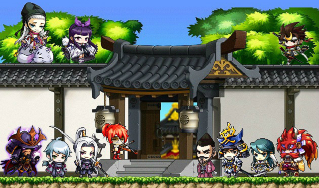
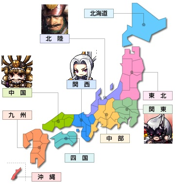
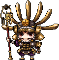
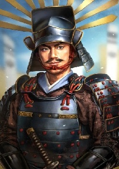
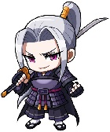
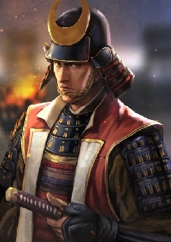
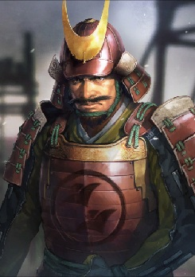

# 反织田联合军

[[toc]]

- 原帖地址：http://www.kmsfan.com/forum.php/thread-4771-1-1.html
- 作者：孤傲de游侠

如需转载请务必保留作者信息，注明转自剧情小组并附上原帖地址

## 人物信息

**姐崎剑斗**

**所属势力**：反织田联合军

**武器**：太刀

**称号**：剑豪

**能力**：晓月流刀术

**身份**：原松山家家臣，现武田家家臣

**绫小路神娜**

**所属势力**：反织田联合军

**武器**：扇子

**能力**：控制天地万物的灵力来攻击敌人

**身份**：阴阳师

## 人物说明

### Chapter 1 - 关于剑豪

- 首先需要澄清的一点是：**剑豪是一个称号，并不是一个职业**。

- 在日本，武士是伴随着大庄园主的兴起而产生的。这些武士习惯使用的武器各不相同：有的偏好长枪，有的喜欢使刀或者剑。16世纪中叶自葡萄牙传入火枪之后，随之也就出现了善用火枪的武士。

- 在这里我们所说的“剑豪”，是对在用刀剑的武者中，技巧出类拔萃的一类人的统称。当然，这个称号肯定不会是自封的。想要获得剑豪的称号，主要是要获得同行们的认可（与同行们互相切磋武艺），或者整个流派的认可（免许皆传）。

- 对于一个正规的刀剑流派来说，师傅对手下徒弟的分级是有严格的规定的。比如，有的水平低的徒弟，出去之后是不能说“我是xxxx流派门下”的；有的水平特别高的徒弟，已经掌握了本流派的所有专有技法，不仅可以在和他人比武时说“我是xxxx流派的”，还会获得一个叫“皆传”的证书，这就是所谓的“免许皆传”【免许的意思就是可以自报家门】。整个日本历史能拿到“免许皆传”证书的不超过10个。

::: tip 最“牛气”的剑豪 - 冢原卜传（剑圣）

- 提起日本著名的剑豪，冢原卜传是一个绝对不能忽略的名字。他和他的弟子上泉信纲合称为日本的两大“剑圣”。

- 为什么？

  1. 从剑术本身的角度来说，他的确是一代宗师级别的存在。他不仅是“新阴流”的开山鼻祖，活跃在战国时期的众多剑豪（比如我们相对熟悉一点的上泉信纲，以及柳生家族），都是出自他的门下。最恐怖的一点，这位剑圣一生与人比试，从未尝过败绩！

  2. 他手下的徒弟的出身很复杂。不仅有普通的习武者，也有达官显贵。最著名的，当属当时的征夷大将军足利义辉（天皇手下总领天下兵权的职位，虚职），以及北畠(音田)具教、细川藤孝等一批高官。其中，足利义辉还被称为“剑豪将军”。因此，他的知名度在当时的上流社会是非常高的。

:::

- 17世纪初，当时的江户幕府对各个剑术流派的等级考核和授予制度进行了统一，流派内的称号授予才变得正规起来。到了19世纪的幕末时期，效忠于幕府、专门负责暗杀倒幕人士的武士组织“新撰组”中，历任队长和主要的副队长，几乎都是在各个流派中拿到过“免许皆传”证书的剑客高手。

### Chapter 2 - 阴阳师，白狐和安倍晴明

- 阴阳师在封建时代的日本，是一个特殊的职业。在当时还相对比较落后的日本，人们对天灾还是更多的倾向于理解成上天的惩罚（像不像以前的中国？）。因此，当时的天皇下面，专门有一个负责观测天文、气象以及占卜、制定历法的机构，称为阴阳寮。而阴阳师，就是这个阴阳寮中的重要一员。

- 阴阳师既然是公务员，那么他的职责是什么呢？占卜、看星相、看面相、测定灾异的方位、画符、念咒、施法，都是他的工作范围。有时他们的一句话，就可能称为当时朝廷的金科玉律。因此不论是阴阳师还是整个阴阳寮，它们的职责决定了它们已经不可避免地沾染上了政治的色彩。

- 安倍晴明则是日本历史最著名的阴阳师，没有之一。他生活的年代大致对应中国的北宋时期。拥有出色天文学和数学知识的他留下的《占事略决》也是现在研究阴阳术占卜的权威文献之一。

- 关于安倍晴明的传说有很多。但关于他的出生却都和一种动物有关，那就是白狐。在流传最广的两个关于安倍晴明的出生的传说中，有一个说的是他的母亲就是一条白狐；另一个就直接说他是由一条白狐幻化而来（不知各位看官有没有反应过来，为什么阴阳的小跟班是一条白狐了么？）

### Chapter 3 - 那些在游戏里出现过的枭雄们- 织田信长和他的手下们

- 对于初识日本战国的童鞋们来说，以织田信长的生平为切入点来了解整个日本战国史，是一个非常不错的选择。这位“战国风云儿”虽然只活了49岁，但他和他手下的团队，几乎将日本从15世纪初开始的全国大混战中解脱出来。

- 信长出生在现在的名古屋地区。小时候的他，因其乖张的举止被称为“尾张的大傻瓜”（名古屋所在地古时候叫尾张），但就是这个大傻瓜，却敢在绝境时率领着仅有5000弱兵，借着暴雨的掩护，一举突袭了敌方20000大军的本阵，直取对方上将首级，一战成名（桶狭间之战）。

- 在一生的南征北战中，信长曾经遭遇过两次包围网，对信长来说，威胁最大的，还是第一次包围网。因为当时的信长刚刚杀入京都没多久，根基不牢。不仅要忙着稳固已占领的地盘，还要应付敌对势力的进攻。因此，游戏中的“织田包围网”在历史上是真实存在的。不过，游戏中能露脸的人物，都是当时雄踞一方的大名。他们都在不同的时期参加过包围网，并不是像游戏中所说的那样，在同一个时间都加入了进来。

- 不知大家还是否记得，游戏里的浓姬BOSS在哪里打？没错，就是比叡山。游戏中的比叡山，被浓姬和森兰丸用做利用灵力操控反织田士兵的基地；历史上的比叡山号称“日本的耶路撒冷”，是日本的佛教圣地。元龟二年（1571），终于从自己妹夫浅井的攻势中喘过气来的信长，于9月气势汹汹的杀进了比叡山的延历寺。因为延历寺的僧兵曾经给信长处处下绊子，严重迟滞了信长回师救援的行动。也因为这次火烧比叡山，信长有了一个众所周知的外号：“第六天魔王”【没错，游戏里的信长也有这个称号】。

- 游戏里的信长，就像是一个暴虐的存在。同样，历史上的信长也有过残暴的一面。不过他屠杀的对象多为和他敌对的宗教势力。其中比较出名的除了火烧比叡山延历寺，还有针对长岛城的宗教信徒的反抗行动（持续时间七年，为了讨平长岛城织田先后三次派兵，折损大将数员）。有兴趣的童鞋可以自行搜索一下“长岛城一向一揆”。

- 信长的成功不仅靠的是他自己出众的军事才能，更重要的是他的识人能力。这一点在他的地盘变大之后体现的尤为重要。从他接手织田家开始，被他赏识和提拔的四位将领，被后人称为四大天王。

- 这是被信长从一介布衣之中提拔上来的武将，也是日本很长一段时间里“平民励志”的典型。他出色的办事能力，对机会的敏锐嗅觉，使他不断地累积功勋，从而在织田家出人头地。

- 当他还是一个无名小卒时，他能巧妙的利用地形，一夜之间在敌人的要道处筑起进攻的桥头堡（墨俣一夜城）；也是他，在主力部队急需撤离时勇敢地挺身而出，以数百精兵迟滞对方三万大军的进攻，为主力部队的撤退赢得宝贵的时间（金崎大撤退）。

- 秀吉在信长的地区攻略中，主要是负责中国地区（他们管当时的中国叫“唐土”，或者干脆直接叫“大明”）。而他的对手，就是当时中国地区的霸主，稀代谋神毛利元就。在得知主公被暗杀后，他率部五天之内狂奔200公里山路，第一个赶到京都击溃叛军，从而一战奠定自己的威望（中国大返还，山崎之战）。顺带提一句，我们经常听到将某场关键的比赛称作“天王山之战”的说法，而这个“天王山”的典故，就是出自山崎之战。

- 在这之后，羽柴秀吉再接再厉，平定了织田家剩下的几位重臣，并发动了一系列战役，将整个日本基本纳入自己的统治，并当上了朝廷的太阁（文官最高职位，秀吉的出身决定了他无法就任象征武官最高职位的征夷大将军）。晚年的秀吉倾整个西国之兵进攻朝鲜王朝。最后与明朝联军在朝鲜半岛血战七年，最后让后金的努尔哈赤，和蛰伏了近半个世纪的德川家康捡了个大便宜。

羽柴秀吉

官职：筑前守护 → 太阁

- 游戏中的明智光秀，是一个冷酷而无情的存在。他不仅对樱乃姬所在的松山家族下达了灭门令，还在本能寺发动叛乱，使信长的仪式受到了严重破坏。

- 然而，历史上的明智光秀，却是一个知书达理、极有知识涵养的儒将。

- 他与信长的会面其实很有戏剧性。在前面提到过的冢原卜传的弟子，“剑豪将军”足利义辉被刺杀后，义辉的弟弟义昭继任征夷大将军职位。义昭当时暂住在百年名门朝仓家，不过义昭觉得这个百年名门没多少实力，因此委托了当时还在朝仓家当官的明智光秀前往信长处，传达希望能和织田联手的事。信长很爽快的答应了下来，也很敏锐的察觉到光秀此人的才能，于是光秀就这么着，一直为信长效力了。

- 因为和朝廷的特殊关系，因此织田家所有和朝廷之间的往来交涉，及近畿地区（大致对应上图中的关西地区东部）的治理都由他负责【朝廷那个时候没有实权，但有名分。可以类比春秋战国时期的东周，和三国时期的东汉】。但就是这样一个被信长信任的心腹，却在1582年，信长前往前线的途中借宿于光秀下辖的京都 · 本能寺时，突然发动兵变，包围了本能寺，信长负伤后退入寺中放火自尽。史称“本能寺之变”。

- 说“本能寺之变”是日本战国最大的谜团，一点都不为过。这场兵变改变了日本的历史进程。羽柴秀吉率部5天从中国前线强行军200公里赶回近畿让他始料未及。在山崎会战中，光秀失去了占领制高点的先机而战败，于逃亡途中被当地农民刺伤而切腹。史称“三日天下”。他的死也让后人对他的反叛动机而倍感疑惑。或许，也只有他自己最清楚。

**明智光秀**

**官职**：日向守护

- 游戏中的柴田胜家，存在感几乎阿卡林。因为在游戏中武田信玄只是提到了一句“因此柴田胜家担负起了新据点和本能寺之间的联络员”，因此游戏中并没有柴田胜家的形象。

- 虽然在游戏里的存在感极低，但历史中的柴田胜家可是织田家首屈一指的猛将。

- 胜家是从信长的爸爸辈就开始侍奉织田家的重臣。后来信长因为继承人问题和弟弟决裂，胜家站在了信长弟弟一方。但信长打败弟弟继承家督之位后，对胜家的行为既往不咎；而胜家也为信长的器量所折服，从此作为信长的先锋，跟着信长东征西讨。

- 关于他的勇猛作战，在战国逸闻里有个这样的记载：有一次他镇守的城池被叛军围攻。胜家当着全军的面，把仅存的一瓶水一刀劈了，然后身先士卒，率部一鼓作气击溃了叛军。“割瓶柴田”的绰号也不胫而走。

- 在信长的攻略中，胜家是北陆军团的最高军事长官，他的主要对手，是北陆东部地区的上杉家。本能寺之变爆发时，胜家本来是有可能比秀吉赶回京都平叛的，但上杉家的穷追猛打把他绊在了北陆，让他痛失良机。后在与秀吉的争斗中逐渐处于下风。在贱岳之战中，胜家部下的一次失误被秀吉抓住了机会，最后胜家在自己居所的爆炸中，和自己的妻子一起结束了的一生。

**柴田胜家**

**官职**：修理亮

- 在剑豪150级的主线任务里，最后的小BOSS就是这位泷川一益大叔。一副忍者造型，手持双刀，一看就是个飞侠系的（大雾）……

- 首先说一点：泷川本身就是忍者出身……【所以给他配一个飞侠的造型一点不奇怪】

- 泷川的出生地在上图中，关西和中部交界的伊贺地区，最初他也只是一个普通的忍者，后来被信长看中，并提拔为将领。铁炮传入日本后，泷川也逐渐成为了织田家为数不多的铁炮好手，这也是为什么画像的造型拿着一把火绳枪（铁炮），而不是双刀的原因。

- 忍者出身的泷川，在收集情报方面有着过人的能力。在信长的战役中，他经常副将随军出征：作为开路先锋，主要负责扰乱敌人、收集情报；当部队需要撤退时，也常常是由他负责殿后【游戏的截图中，他的绰号是“进退泷川”，这也是织田家对他的评价】。

- 在游戏中，泷川被任命负责本能寺的守卫工作；历史上的泷川，却作为信长的嫡子信忠的副将，参加了对武田的歼灭战，后因功成为了当时织田负责关东地区的最高军政长官，同时也是末代关东管领（朝廷负责统管关东十国的官职，虚职），当时关东的霸主是已经臣服于织田家的北条氏。本能寺之变后，北条氏为了一统关东，向泷川一益发动了进攻，并在神流川战役中击溃泷川主力。泷川狼狈地逃回了织田的大本营，从此被排除在织田的权力中心之外。

**泷川一益**

**官职**：伊予守护 → 关东管领

- 之所以不把德川家康算作织田四天王，是因为德川家康从来就不是信长的臣子（游戏里家康也只是说“我是信长大人的盟友”）。

- 家康以前不姓德川，姓松平。他的爷爷清康也是一个神一般的存在：13岁继任家督，14岁平定自己叔父的叛乱，一统三河。然后和信长的老爹开打，经常把信长老爹打的抬不起头。天有不测风云的是，他24岁时被自己的武将误杀，松平家从此没落，到了家康这一代，松平家已经是臣服于东方今川家的一个小势力。

- 家康和信长小时候其实是见过面的。当时的家康小名叫松平竹千代，在织田家做人质的时候，和年纪差不多大的织田信长相识，并成为了好友。织田在桶狭间之战击败强敌今川义元后，竹千代便率领自己的部众在自己的故乡三河宣布独立，并迎娶织田信长的长女，与织田结成了婚姻同盟。

- 家康通过自己的经营，艰难地扩大着自己的地盘。这期间，有在三方原被武田信玄的赤备打得大小便失禁的惨痛失利（三方原会战），也有被织田信长以通敌罪逼迫，而下令让自己的嫡子（德川信康）自裁的苦涩经历。本能寺之变时他刚好受邀在大阪附近游玩，为避免遇险，他带着随从一路穿越地形错综复杂的伊贺地区，狼狈逃回了故乡三河（神君伊贺大穿越）。

- 在秀吉得势后，实力不足的他依旧选择了隐忍，在取得对秀吉军事行动的胜利（小牧长久手之战）后果断选择臣服秀吉，并作为臣子参加了秀吉平定日本东部地区的历次战役，尽管自己的领地从故乡三河转封到了一片废墟的关东。

- 1598年，被侵朝搅的心力憔悴的秀吉去世，隐忍了快半个世纪的家康终于等到了机会。在1600年的关原会战中一锤定音，涉险击败了政敌石田三成等人；后又在两次大坂战役（1614年大坂冬之阵；1615年大坂夏之阵）中，彻底剿灭了丰臣家族，开创了日本历史上最后一个幕府- 江户幕府。

- 家康手下也有得力的将领。而游戏中出现的本多忠胜，就是其中的代表。他手持的武器叫“蜻蜓切”。曾经有蜻蜓停在这把枪的枪刃上，结果蜻蜓因为自己的重力被枪刃劈成了两半，因而得名，在当时也是被誉为“日本三名枪”（御手杵，日本号，蜻蜓切）之一。在跟随德川家康的过程中，本多忠胜也是力战无数，但从未受过伤。信长称其为“日本之张飞”，丰臣秀吉则称赞他是“东国无双之武将”。家康的对手也曾评价说：“弱如家康一样的大名，却有两样不该有的珍宝：一个是外地输入的珍贵动物毛皮，另一个便是如本多忠胜般勇猛忠心的武将啊！”

**德川家康**

**官职**：三河守护 → 征夷大将军

**德川猛将**：本多忠胜

- 游戏中的森兰丸，机灵中带着些许狡黠。与神娜同时作为土御门晴明的得意弟子，兰丸最终追随了信长，并和信长之妻浓姬，一起成为了织田军阴阳师部队的指挥官。以比叡山为根据地，专门负责对反织田联盟的士兵施法，让他们受到织田方面的控制。

- 兰丸的职务是信长的随从，也是他的小姓。在战国，小姓一般会被人联想到通过卖菊花上位的“男宠”，不过幸好兰丸跟的是一个对男宠毫无兴趣的信长。

- 兰丸能深得信长的信任有两个原因。

- 兰丸的父亲森可成，是参加过信长中前期几乎所有战役的老将。然而在一次守城战中面对几倍于己的敌军顽强抵抗，最后壮烈牺牲。信长的主力当时被比叡山的僧兵牢牢地钉死在了近畿，信长在痛惜之余，第二年便纠集大军，一把火烧掉了当时阻碍自己的延历寺。父亲森可成牺牲时，兰丸的二哥森长可只有12岁，兰丸6岁，四弟森力丸5岁，五弟森坊丸4岁。信长指示年幼的森长可继承森家，剩下的三兄弟便把他们都收在身边，亲自培养。

- 兰丸小时候就显示出了出众的数理天赋，还是一个美少男。信长因其美貌甚至专门下了一道命令，让他不用行成人的束发之礼。所以16、7岁的兰丸却依然是一副少年装扮（日本古代一般13岁举行成人礼），弄的他非常尴尬。14岁开始，大到出面接待外国使节和公文往来，小到信长的起居，都由兰丸全权负责【类似于总秘书长】。甚至有史料记载说他还是负责信长安全的忍者部队的首领。能得到信长如此的重用，足以证明兰丸的才能之非凡。令人惋惜的是，本能寺之变中，18岁的他与两位弟弟（森力丸、森坊丸），为保卫主公信长，均付出了自己宝贵的生命。

**森兰丸**

**职务**：信长随从之一，小姓

- 游戏的截图其实已经把浓姬的生平就介绍的差不多了。游戏中的浓姬和阴阳术扯上了关系，在BOSS战中，她会使用很多蝴蝶给玩家制造各种各样的障碍【名字里有个“蝶”，恩，仅此而已】。

- 单就浓姬在历史上的记载而言，并不是很多。浓姬本人也是政治婚姻下的牺牲品。她的父亲是织田家北方的斋藤家家督，人称“蝮蛇”的斋藤道三。浓姬和信长的婚事，是在信长爸爸还在世的时候就已经定下来的。

- 关于浓姬和信长有一段比较著名的故事是这么说的：

- 斋藤道三在归蝶出嫁前，给了她一把肋差（小短刀），并对她说：“女儿啊，爹爹给你这把肋差。如果信长真的是像传闻中的那样，是个大傻瓜的话，那你就等时机成熟，找个机会把他杀了。我们父女俩里应外合，灭了织田家！”

- 归蝶接过父亲手里的刀，看了看，便揣在了怀里，幽幽的来了一句：“好吧，如果他不是像传闻中说的那样的话，也许这把刀，我就得对准父亲大人了。”

- 洞房当晚，信长在归蝶身上看见了这把肋差。他便问归蝶：“美浓的公主啊【美浓是归蝶的出生地】，你的这把肋差，是岳父大人送给你，让你来刺杀我的么？”

- 归蝶向信长行了个礼，答道：“父亲大人让我好好辅佐信长大人您。”

- 信长哈哈大笑：“有意思的姑娘。你信么？不仅是我父亲留给我的尾张，还有岳父大人的美浓，都会是我的。你怎么看？”

- 归蝶微微一笑：“如果我发现您连我父亲大人的美浓之地都拿不下来的话，也许那个时候我就会将这把刀对准您了吧。”

**斋藤归蝶 / 浓姬**

**信长之妻**

### Chapter 4 - 那些在游戏里出现过的枭雄们- 毛利元就和他的儿子们和敌人们

- 在战国，父子、兄弟之间的骨肉相残是家常便饭，但像毛利家这种兄弟之间、父子之间精诚团结，共谋大业的情况，倒并不是很多见。

- 毛利元就有十几个儿子。不过最为出名的，还是他的前三个儿子：长子隆元，次子元春，三子隆景。元春被父亲派到到吉川家当家督，改名“吉川元春”；隆景则被派遣至小早川家，改名“小早川隆景”，另外位于毛利家南方的海盗村上家族，也是由隆景负责联络；长子隆元则作为接班人大力培养。

- 元就最著名的事迹当属“三矢之训”。为了让自己着重培养的三个儿子充分理解团结的重要性，元就将三个儿子叫到一起，先让他们折断一根箭，三个人都很轻松的完成；当元就把三根箭捆在了一起再交给他们的时候，连最勇猛的次子元春都没能折断。也因为这样的教育，元春和隆景，分别率领着吉川家和小早川家，共同支持着父亲的事业，人称“毛利两川”。

- 元就的发迹史也是一部策略史。当时中国地区的霸主还是大内家和尼子家，元就接手时，毛利家还只是大内家的一个附属势力。而他通过不断的分化拉拢瓦解周围的小势力，一点点扩大自己的势力。在遭受尼子家大军的进攻时，也果断借助大内家的力量，利用智谋和敌人展开周旋（吉田郡山战役）。当自己的羽翼渐丰而大内家日薄西山时，他又果断宣布独立，面对大内家近2万的讨伐军，他率5000兵马于严岛大破敌军（严岛合战）。

- 元就去世时，毛利家的领地几乎涵盖整个中国地区，领地面积和动员兵力仅次于织田。信长死后，毛利家与秀吉亲近，但因在关原之战中站错队，得罪了家康，领地遭到了削减。直到250年后的倒幕运动，已经变身为长州藩的毛利才有机会报这一箭之仇。

- 元就的敌手之一，便是曾经的中国霸主尼子氏，而游戏中出现的这位山中幸盛，便是尼子家后期最负盛名的勇将，尼子十勇士之首。他在主家灭亡后，终其一生都在为主家的复兴而奔走。他曾经将自己的鹿角日月盔面对月亮，摆在山顶的石头上，郑重地发誓：“为了复兴尼子家，我愿受尽七难八苦！”【游戏里的山中幸盛也会说这句话】。最后因为实力的悬殊差距，在上月城力战被俘。毛利家知道他是绝对不会投降的，便在将其在押送的路上刺杀，幸盛牺牲时年仅34岁。

- 虽然没能复兴尼子家，但山中幸盛的忠诚和他付出的一切努力，被后世作为武将之典范。许多武将在13岁行成人礼时，都会对着鹿角日月盔发誓，以表敬仰和学习之意。游戏中，山中幸盛也是剑豪的一转教官。这样的设定也是用以突出幸盛的人格魅力，希望剑斗在成长的过程中，也能像他一样尽忠于主事，成为武将之典范。

### Chapter 5 - 那些在游戏里出现过的枭雄们- 武田信玄和传奇的真田家族

- 提起《孙子》，中国人会联想到春秋时期的军事家孙武，而日本人会告诉你，他们除了能想到中国的孙武，还会想到“甲斐之虎”武田信玄。

- 幼年的信玄在成长的过程中，亲眼目睹了父亲信虎连年的征伐，给民众带来的苦难。20岁时，他放逐了父亲信虎，接管了武田家。在这之后，信玄不断的发掘人才，发展民生，终于将武田家从仅有甲斐一国，变成一个全盛时期拥有甲斐、骏河、信浓的强国，还将势力拓展到了临近的地区。他制定的《甲州法度次第》，也是战国历史上第一个真正意义上治国的纲领性文件。也是在这份文件中，第一次提到了“战国”这个概念。

- 信玄的治军思想，是《孙子兵法》中的四句话：“其疾如风，其徐如林；侵略如火，不动如山。”信玄要求他的部队要像孙子的这四句话一样，拥有强大的执行力；而他麾下最精锐的骑兵部队“赤备”，是他克敌制胜的利器。晚年的信玄，应邀加入织田包围网，他的赤备也让德川家康，在三方原会战中遭受了他一生中最为惨痛的失败。可惜信玄去世后，武田家在长筱之战中，惨败给织田德川联军，折损众多良将，最终在1582年，信长发动的甲州征伐中走向了灭亡。

- 和织田信长不同，武田信玄是不排斥男色的。他也曾经因为和其他小姓鬼混而被一个吃醋的小姓，春日源助捉奸在床，之后信玄还亲自给源助写了道歉信。这封道歉信的原稿，现在还保存在东京大学史料编纂室。而这个敢捉主公奸的小姓春日源助，就是后来被誉为“逃弹正”的武田四名臣之一，高坂昌信。

- 下面来说说这个真田幸村。

- 玩过战国无双的童鞋对他一定不会陌生，但实际上，他的爸爸和爷爷，在名气上同样不亚于他。

- 幸村的爷爷真田幸隆，自早年起就侍奉信玄。因善于用计攻城拔寨，因而得绰号“攻弹正”，曾在一天时间内，用计攻破了信玄花了一年时间都没能攻下来的砥石城。是信玄最为重要的谋士之一；幸村的爸爸真田昌幸，自幼便被信玄收为“奥近习六人众”（可以近似理解为重点班，主公亲自培养）之一，深得信玄军略，被信玄誉为“吾之眼”。武田灭亡后，昌幸带领真田家，在三大势力（德川、北条、上杉）中艰难周旋，最后臣服于丰臣家，被丰臣秀吉称为“表里比兴之人”。曾经在自己的居城上田城，两次大破数倍于己方的德川军（两次上田合战），名震天下。

- 幸村的光辉事迹，主要是第二次上田合战和两次大坂战役。第二次上田合战中，信繁承担了诱敌和突击的任务。在父亲的指挥下，幸村仅以几千兵力，迟滞了德川部近四万大军的行军。1614年的大坂冬之阵中，他为防守大坂城构筑的“真田丸”成为了德川方的噩梦。面对德川方的轮番攻击，真田丸岿然不动，“关东雄兵百万，竟无一人是男儿！”是幸村面对绝望的德川方发出的嘲讽【游戏里的NPC也有这句话】。1615年大坂夏之阵中，幸村在战况危急之时，毅然率骑兵向德川军大本营发动决死突击，最后功败垂成。而他在大坂之战以寡击众的英勇表现，被江户幕府和诸国大名记录下来，而闻名于现世。被誉为“日本三大悲剧英雄”之一（源义经、楠木正成、真田幸村）。

### Chapter 6 - 那些在游戏里出现过的枭雄们- 上杉谦信和直江兼续

- 在战国纷乱的斗争中，高举“义”字独行于世的上杉谦信，是一个特别的存在。人称越后之龙的TA，以神鬼莫测的用兵，让敌人闻风丧胆。

- 上杉谦信原名长尾景虎。原来的上杉家是关东的超级名门，之所以在“名门”之前加上“超级”二字，是因为百余年来，上杉家一直是世袭关东管领。不过，到了谦信这里，当时的关东管领没有子嗣，而景虎频频南下关东，讨伐管领的死敌北条氏。关东管领一想，干脆把这职位给TA好了。于是经管领本人推荐，征夷大将军批准，已经就任越后守护的长尾景虎又正式接任关东管领一职，并改姓上杉。

- 谦信从小就展现出了非凡的军事能力。当时的越后有“小战国”之称。13岁的谦信即使是在主持父亲的葬礼时，也得身穿铠甲，以防不测。就是在这样一个险恶的环境下，TA一步步地将越后诸将收入自己的麾下。这期间他镇压的叛乱，也是数不胜数。

- 谦信指挥的战役很多，无论是关东，信浓，还是越中，都能看到TA活跃的身影。TA曾经率领着关东诸部11万余人，围困北条氏的居城小田原长达一个半月；也曾经在十余年间，和武田信玄在川中岛血战五场（五次川中岛合战）；在武田信玄去世后应邀加入第二次织田包围网，尽起越后之兵，在能登半岛的手取川，把当时织田的北陆地区指挥官柴田胜家打得抬不起头（手取川会战）。

- 关于谦信一直流传着一个无法证实的猜想：谦信是个女孩子。虽然现在并没有直接证据证明，但这样的猜想一直存在。因此，游戏中谦信NPC的造型采取了中性化的处理，一眼看过去，基本上看不出谦信是男生还是女生。TA一生不近女色，也没有直系后代。TA因酗酒诱发的脑溢血突发去世后，TA最喜欢的养子上杉景虎，和TA的侄子上杉景胜为了争夺上杉家的领导权展开了争斗（御馆之乱），此时，上杉家的重臣直江兼续坚定的站在了景胜一方，并最终辅佐景胜取得了上杉家的领导权。

- 直江兼续是上杉后期的重臣，他最显眼的标志，便是他的“爱”字头盔。御馆之乱后，兼续作为上杉景胜的心腹，总揽家中的各项内政外交事务。他一人受封的领地（60万石）占到了当时上杉家领土总面积（120万石）的一半，虽然只是家臣，但他的领地却比当时许多大名的领地还要多，因此他和奥州伊达家的片仓景纲，合称为“天下两大陪臣”。

- 在这里顺便解释一下“石(音但)”这个概念。
[hide]- 日本领地的多少以粮食产量计算。一个成年人一年的口粮称为“一石”。60万石的意思就是拥有的土地所生产的粮食可供60万成年人吃一年。土地养活的人越多，战时可动员的兵力也就越多。这个数据一般会随着土地的开垦而随时变化。主公对下属领地的粮食产量的普查，称为“检地”。一般这个数据是各个大名的机密数据，往上级报的时候，大多含有水分。[/hide]

- 1599年，长期与丰臣家亲近的景胜在秀吉临终时被任命为五大老之一，而蛰伏了半个世纪的家康便开始蠢蠢欲动，派人驰书景胜，责问他为什么擅自进行打仗的准备。这个时候，作为家中绝对元老的直江兼续，给家康写了一封回信。这封回信，就是著名的《直江状》。兼续在信中不仅为主公的行为进行辩护，还以反讽的手法痛斥家康在秀吉死后的种种不安分行为，揭示了家康图谋天下的野心。据传家康在看到这封信后，气急败坏的说：“吾生五十三年阅状无数，此为当中最无礼放肆之书状！此小子欺人太甚，焉能容忍如此之作！（53年来我看过无数书信，这封书信是我见过的最无礼、最放肆的！这小鬼头欺人太甚，我怎么可能容忍这样的书信！）”。而这封在日本脍炙人口的《直江状》，也成为了1600年关原会战的导火索。

### 写在最后的话

- 是非成败转头空，青山依旧在，几度夕阳红。

- 岁月静静的流淌，不变的山水年复一年地流转着枯荣。无言的大地见证着英雄一个个走过，在这片土地上留下属于他们的记忆。曾经叱咤风云的武将们，如今我们却只能在烟海般的史料中，或画师的笔下，才能追寻着他们的足迹，缅怀他们曾经的辉煌和荣耀。唏嘘也好，惋惜也罢，这，才是历史。

- 抚摸着岁月的刻痕，耳畔的金戈铁马声依稀可辨。激荡人心的岁月一去不复返，或许在某个不起眼的拐角，一块砖，一片瓦，甚至只是一个熟悉的图案，都能引起我们无限的遐想。

- 一壶浊酒喜相逢，古今多少事，都付笑谈中。

剧情组出品—
