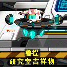

# 尖兵

- 原帖地址：http://www.kmsfan.com/thread-4753-1-1.html
- 作者：斯乌
如需转载请务必保留作者信息，注明转自剧情小组并附上原帖地址

## 人物信息

**尖兵（XENON）**

**所属势力**：反抗者

**武器**：能量剑

**称号**：尖兵（儿时的外号是 熊猫）

**能力**：能量剑多模式操作、外甲推进、支援系统、次元战机

**职务**：维利塔斯研究所特工（原属格里梅尔研究所的人形兵器

## 人物传记

- 本是人类的他在儿时被疯狂科学家格里梅尔抓获，博士应用生命工程技术由机械与生命相结合将他打造成了最强人形兵器 代号：尖兵，被博士洗去了过去的记忆 沦为战斗兵器的他 数十年来一直在秘密研究所里接受着各种战斗训练，在一次反抗者军团的潜入行动中，被常年关在研究所的他 遇见了反抗者首领吉格蒙特，此次契机唤醒了他沉睡的记忆，在机械猫 鲁提的帮助下 为找回自己失去的记忆 他擅自释放了吉格蒙特，却被研究所的另一个改造人维丽尔发现与之展开了激烈的战斗，这时反抗者的援军赶到 趁乱带着他和鲁提一起逃出了研究所，在与反抗者们的接触和帮助下渐渐了解到 自己曾生活在埃德尔斯坦，与吉格蒙特、韩利泰、伊莱克斯和贝尔等人是要好的玩伴，自数十年前埃德尔斯坦被黑色之翼占领后，自己便被作为实验体抓走，而吉格蒙特等人为了守卫家园成立了现在反抗者。

- 与此同时格里梅尔博士派出了改造人维丽尔打算回收逃亡中的尖兵，为了不让自己再次被格里梅尔所控制 也不想再给反抗者们添更多麻烦，他在鲁提的帮助下拆除了身上的控制装置，但由于控制装置连接着战斗系统，装置的拆除也使他丧失了大半的战斗能力变的十分虚弱，在自己能力消弱和被博士追捕的现在 为了更好的隐藏自己，他和鲁提决定前往人口密集的射手村避避风头，来路不明身又身无分文的他们在射手村村长的指点下通过帮助村们做事逐渐被村里的人们所接受，在这个过程中学会了人与人的相处，然而这短暂的和平并没有持续太久 他们又再次感受到了维丽尔的脉冲信号，无奈之下他们只能选择离开，通过金银岛六岔口逃到了异世界格兰蒂斯的万神殿，在警卫队队长卡塔利安的帮助下开始了在万神殿的生活（期间再次遭遇维丽尔的追捕），正当他们准备再次动身逃往其他城市时，从影子商团那收到了反抗者首领吉格蒙特的秘信，为了使他免受格里梅尔博士的追捕 反抗者决定把他派往新成立的海底研究所- 维利塔斯，让那里的研究员为他制作能够隐藏行踪的脉冲干扰装置。

- 脉冲扰乱装置的制作并没有花多长时间，它的原理是通过对目标的脉冲信号进行分析，在冒险岛世界各地设置拥有相同频率信号的装置，将自己的信号和其他信号混在一起 以此骗过敌人，但是必须在很多地方都设置扰乱才有意义，为此他背着脉冲干扰器开始了游走于各村落的设备安置之旅，在路径射手村的时候收到了文博士发来的报告，说在他附近检测到了疑似黑色之翼的可疑人物，根据情报 他立即动身来到了黑色之翼成员所在的石巨人寺庙隐蔽洞穴 意外偷听到了黑色之翼干部塔高斯和弗朗西斯的谈话，在他们的对话中了解到格里梅尔为了抓住自己秘密动用了部分黑色之翼的成员【接到这个任务的附带信息“不准告诉任何人 包括奥尔卡”后，作为黑色之翼干部的弗朗西斯也开始从格里梅尔的行为中察觉到了异样】

- 就在这时他又从鲁提那收到了维丽尔给他发来的决战信息 说要与他做最后的决断，地点是他们当时逃出的那间研究所，并宣称如果不来便要毁掉整个埃德尔斯坦，在这样的威胁下他和鲁提只好再次来到了那个曾经囚禁过他们的研究所，此时的这里已经被废弃多时，自尖兵逃走后这个研究所的所有资料都被清除，在与维丽尔的战斗中，尖兵再次以“完美改造体”的压倒性实力击败了维丽尔，虚弱的维丽尔在战败后告诉了他“这次是自己最后的机会” 如果这次依旧没有打败尖兵，自己将会被格里梅尔视为失败品而被报废处理掉，尖兵试图劝说让其与自己一同回维利塔斯，但最终维丽尔以“格里梅尔是制造出自己的父亲，所以即便要被报废处理掉也要回到博士身边”的理由独自离去。

- 另一方面，因为这次尖兵的叛逃让格里梅尔意识到了自己能力的不足，为了弥补这方便的缺陷，他以“复活斯乌（奥尔卡的哥哥）必须获得生命炼金术的方法”为由欺骗奥尔卡去炼金之都玛加提亚 帮自己盗取了蒙特鸠研究所的禁忌之书，格里梅尔应用书中所记载着的禁忌炼金术（黑魔法），以斯乌的身体为实验体开始了新的研究，因之前有了尖兵叛逃事件的教训，格里梅尔用禁忌炼金术对斯乌的记忆进行了彻底性的清除，并控制斯乌夺取了奥尔卡的翼魔之力 成为了黑色之翼的新头目，宣称要将斯乌的身体献给黑魔法师作为复活用的容器，自己将取代翼魔双子成为黑魔法师的军团长，而身受重伤被遗弃在旧研究所的奥尔卡被反抗者的侦查员找到 带回了组织的秘密据点

## 能力相关

### 格里梅尔博士研究所开发的技术

- 支援系统 改造人的核心系统，通过吸收周边能量 把敌人攻击中的热能和动能转换成供自己使用的电能，并将此能量进行压缩聚焦，在危机时刻支援系统会强制解除自身对能量消耗的使用限制，藉此引出比原本的威力强上数倍的绝招（尖兵体内设有几个需要消耗大量能量的爆发式攻击技能，而这些技能只有在能量全开的状态下才可以使用）

- 能量全开的状态每天最多只能维持两个小时（不过格里梅尔博士已经研发出了 无限能量全开触发器这样的设备）

- 能量剑多模式链路技能：能量剑可以变形为鞭型的剑，在剑与鞭之间变化，能够自由伸缩，并能够攻击中远距离的敌人，攻击方式多样 在伸展状态下能够进行多段式组合攻击

### 由维利塔斯研究所开发出的技术

- 次元变形战机：次元变形战机可以通过变形以达到 水陆空三用的效果，不管是上天还是入水，它都可以载人去任何想去的地方，激动性强，而且内置超强战斗设备（聚能脉冲炮），坚固与精致并存，是当之无愧的完美作战兵器

- 次元变形战机的制成材料：战机的外壳是使用格兰蒂斯世界名叫克拉比顿和水纹石的生命体的外壳制成，而战机内置的聚能脉冲炮的弹药是使用芒果泡泡 蜜瓜泡泡和樱桃泡泡进过化学混合制成的特殊导弹

### 维利塔斯研究所

- 维利塔斯研究所设立于海底世界，是奴属埃德尔斯坦反抗军的研究机构，主要任务是对发生在冒险岛世界各地异常现象进行研究和为未来的战争作准备进行秘密武器的开发，基地周围的几道防御壁会吸收掉所有的信号，不仅可以屏蔽外部的信号，内部发出的信号也可以完全屏蔽，以此保证基地的安全性和隐秘性。

## 维利塔斯的工作人员

### 文博士

**文博士**

**职务**：所长（物理学者）

**简介**：反抗者 秘密研究机构维利塔斯的总负责人

### 埃德尔

**埃德尔**

**职务**：工程师

**简介**：天才工程师，次元机械战机的主要设计者

### 尖兵

**尖兵**

**职务**：特工

**简介**：由格里梅尔博士应用生命工程技术制作出的最强改造人

### 纳撒尼尔

**纳撒尼尔**

**职务**：研究员（炼金术士）

**简介**：来至炼金之都 玛加提亚，为调查世界各地出现异常空间的原因来到这里

### 普罗麦特

**普罗麦特**

**职务**：研究员（生物学者）

**简介**：曾与格里梅尔同在一个研究所工作过，主要的研究项目是生命工程学

### 鲁提

**鲁提**

**职务**：研究所吉祥物

**简介**：由格里梅尔博士制造出的辅助型机器人，原型不明

## 经典语录

普罗麦特：天才与疯子只有一线之隔，身为学者，掌握着世界的真理，理应对这个世界负起责任，科学的力量应该用来促进人类的发展，而不应该用来满足个人的欲望，如果无法明白这一点，即便拥有天才的大脑，也只能是个危害世界的害虫（格里梅尔就是一个很好的例子）

普罗麦特：如果极力追求真理，谁也不敢保证自己的内心不会产生和格里梅尔一样的欲望，不光是我，其他人也一样，虽然动机很单纯，但大家都是学者，谁都会拥有这样的欲望，科学家必须为自己的好奇心导致的后果负责

鲁提：即便记忆被删除，感情依旧能存在，刻印在灵魂中的羁绊是不可能那么轻易被抹除的

尖兵：失望？啊。。原来如此。。这种感觉就叫做失望啊。。虽然从一开始就明白不可能剩下什么线索，但也许在我内心的某个角落还是暗暗期待着可以找到些什么吧

鲁提：让我在包里呆了那么长时间，感觉腿变的更短了。。

鲁提：对我来说，不管过去怎样，现在的幸福更加重要

切奇：正是因为不能光看外表来判断事物，这是世界才这样丰富多彩，正如我这可爱迷人 人畜无害的小熊外表一样

[相关视频](http://player.youku.com/player.php/sid/XNTY1NDgxNzYw/v.swf)

剧情组出品—
