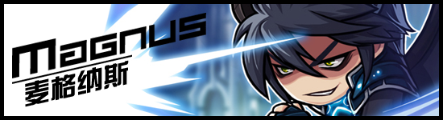
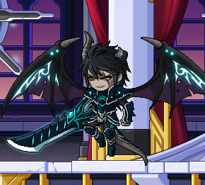
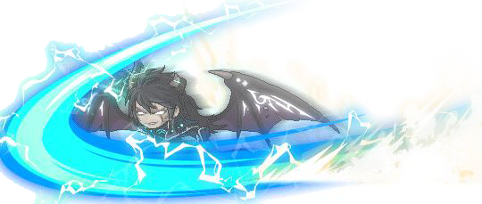

# 麦格纳斯

[[toc]]

- 源地址：http://www.kmsfan.com/forum.php/thread-4734-1-1.html
- 作者：斯乌

如需转载请务必保留这栏信息，注明转载自剧情小组并附上源帖地址

剧情小组倾情奉献 冒险编年史：http://www.kmsfan.com/thread-4730-1-1.html

## 人物信息

**麦格纳斯（Magnus）**

**所属势力**：黑魔法师军团

**武器**：诅咒·凯瑟利安

**称号**：暴君

**能力**：神经毒素、落星、诺巴剑术

**职务**：军团长

## 能力相关

- 神经毒气：在一定范围内释放神经毒素，截断吸入者脑部所发出的“控制四肢”的命令以此封锁其行动，并造成持续掉血伤害。

- 落星：召唤大面积杀伤力巨大的陨石群 坠落，砸中则残没砸中也能很好的制约对手行动

- 诺巴剑术：被评议会驱逐前是实力不亚于前任凯撒的诺巴族战士，拥有相当彪悍的剑术实力

## 对战记录

对战对手 | 结果 | 备注
--- | --- | ---
对战对手 | 结果 | 备注
狂龙战士（前任） | 平 | 用卑劣手段用渗入致命毒素的剑砍伤压制前任狂龙战士大部分实力，最后关头狂龙战士在死前使用耗尽生命的技能日珥，全灭了幽灵军并对麦格纳斯造成重创。
古瓦洛 | 胜 | 靠偷袭一刀将其斩杀
夜光法师 | 中断 | 吸取古瓦洛能量后夜光的攻击完全伤不着麦格纳斯
赫里希安攻击队3人组 | 完胜 | 在保护膜下被压制了大部分能力，不过依旧以压倒性实力将3人击溃

## 人物风貌

- 性情傲慢，为得到力量不择手段的男人，一心想得到“诺巴最强战士”的名号，只要能让他能力提升不管对方是谁即使是魔鬼都愿与其做交易

- 童年时代的麦格纳斯与凯撒是好友同时也是竞争对手，他们一同努力学习剑术，拥有不亚于凯撒的实力。长大后凯撒被命运选中继承了诺巴精髓成为了下一任的狂龙战士成为了诺巴的守护神，麦格纳斯认为成为狂龙战士的人本该是自己，因而嫉妒成了恨，坠落成为了一味追求力量的凶恶之徒，后被评议会视为威胁将其驱逐出境。

## 人物传记

- 属于格兰帝斯世界。曾是诺巴族的一名战士，因嫉妒诺巴族的守护神狂龙战士而投靠达勒摩尔，成为其手下之一，在达勒摩尔进攻树精族首都阿波利斯时，麦格纳斯作为先锋队打开了诺巴族首都赫里希安的保护罩，导致赫里希安沦陷，并使奸计用剧毒之剑砍伤狂龙战士，而狂龙战士在死前使用耗尽生命的技能日珥，全灭了幽灵军并对麦格纳斯造成重创，麦格纳斯生命大幅缩短，因曾得到过达勒摩尔的力量而捡回一命，后通过次元门来到了枫世界寻找能够摄取足够生命力的能量为此加入了黑法师麾下。

- 决战时刻，流浪的5名英雄相继攻入时间神殿，麦格纳斯眼看黑魔法师即将被打败，趁乱斩杀军团长-大精灵古瓦洛并夺取其力量后返回格兰蒂斯，经达勒摩尔协助下，麦格纳斯蓄积自身实力，占领了诺巴族的首都赫里希安并将诺巴王族的宫殿改造成为了自己的暴君要塞。

## 最新近状

- 自占领了诺巴族的首都赫里希安并将诺巴王族的宫殿改造成为了自己的暴君要塞后，就开始酝酿着进攻万神殿的计划，为破坏万神殿保护膜而收买了大量祭祀夺取圣物，当听到手下“已经夺取两个圣物”的报告后，看着即将崩溃的保护膜，亲自带领自己的幽灵军主力向万神殿发起了进攻，可是此时万神殿方面已经夺回了圣物将其重新安置，保护膜再出启动，在保护膜会对保护膜内测范围敌人强制弱化制造强力压制的这一特性下，手下的幽灵军几乎全灭，期间遇见了现任的狂龙战士以及诺巴新星爆莉萌天使和诺巴骑士团的贝德罗斯3人，被保护膜压制大部分力量的麦格纳斯依旧以压倒性的实力击溃了3人，此时卡塔利安带领的守卫队赶到，看情况处于下风后从容的离开。

- 这次的失败让麦格纳斯失去了大量战力，由于自己的傲慢所以没有向达勒摩尔报告自己的失败也没有请求增援，失去大量战力的他只的退攻为守。另一方面这次的战斗让诺巴族转守为攻，诺巴骑士团在赫里希安边境森林设立了赫里希安反击本部，现任狂龙战士通过次元门来到了枫世界，与圣地现任女皇希纳斯取得联系并与联军结盟。在诺巴族的强势攻势以及联盟军的协助下，赫里希安失守，暴君城的警备战力也被逐个击破，麦格纳斯已被迫困守于暴君城堡的最顶层。

## 经典语录

1. 嘿嘿~你尽管可以当成是我的恶趣味啊，我还想再看看你像落水狗一样挣扎的摸样呢

2. 就在此处，数万个幽灵听我的指挥，哪怕你还像平时那样健康也孤身难敌众手，这就是你的坟墓！

3. 别担心 最后关头我会亲手送你上黄泉路，灭了你 然后登上诺巴最强战士的宝座

4. 说的也是，你这种天才怎么会理解我的苦衷呢？我想要变得更强大。而只有达勒摩尔才能实现我的愿望

5. 你真的很强。。但这次赢的人是我！！（VS前任狂龙战士时）

6. 你就只有这点程度吗？不过时间到了呢，可惜啊，看来只能下次再解决你这家伙了，这边的世界已经没有什么需要我做的了。（决战时刻对夜光法师）

7. 一群不知天高地厚的臭小鬼，就算我变弱了，也不代表你们就能比我强吧？（VS 现任狂龙战士、爆莉萌天使、贝德罗斯 3人组）

8. 是卡塔利安啊，之前的小毛孩长大许多了嘛，现在我的情况占下风，就放你们一马，但今天的失败我不会忘记的，你们就尽情享受这一时的胜利吧。

剧情小组—
