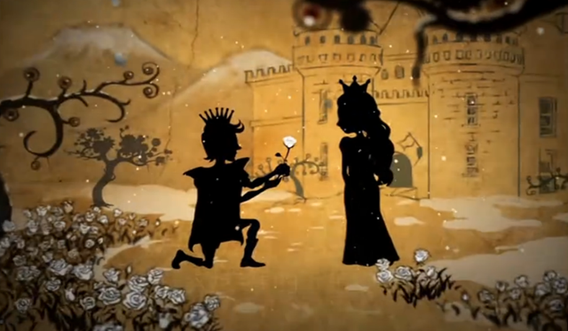
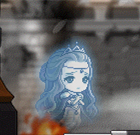
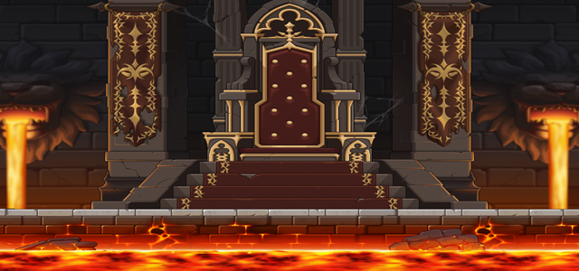
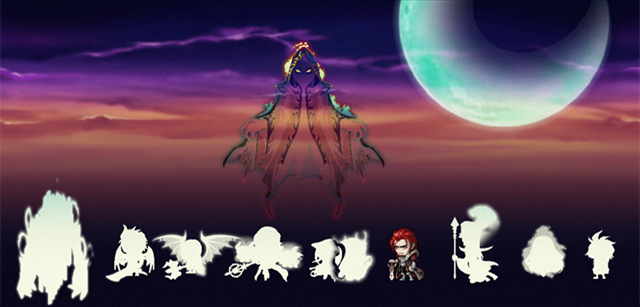

# 班·雷昂

- 原帖地址：http://www.kmsfan.com/forum.php/thread-4736-1-1.html
- 作者：丨叶枫丨
如需转载请务必保留作者信息，注明转自剧情小组并附上原帖地址

剧情小组倾情奉献 冒险编年史：http://www.kmsfan.com/thread-4730-1-1.html

## 人物信息

**班·雷昂 （Von·Leon）**

**所属势力**：黑魔法师军团

**武器**：麦克斯班·雷昂长剑

**称号**：狮子王

**能力**：变异、狂化

**职务**：军团长

## 相关能力

**剑术**：在成为军团长之前是个只会用剑的战士，在身边随从得知他的剑术相当出色。

**变异**：投靠黑魔法师后获得的爆发性的变异能力，以出卖自己的灵魂化身成一只巨大的人形狮子，完全丧失理智，变成只会用拳头肉搏的狂暴者。

## 人物风貌

- 为人重义，但很固执要面子，一旦认定的事情只会按照自己的套路进行。因为失去了一切，对现世生无可恋的他向黑暗势力出卖灵魂，他的作为只是因悲惨的命运向世界报复。

- 他古板，不冷不热，性情慵懒。眼底有着浓浓的黑眼圈，看上去饱经风霜，本是一届武夫，在军事方面处理妥当，性格温和且黑白分明，多次在众多军团长的争吵中充当和事佬，本着“人不犯我我不犯人，人若犯我我必犯人”的宗旨逃避现实，对黑魔法师的命令绝对服从，但正因为班雷昂这样平庸的性格经常遭到其他军团长的无视。

## 人物传记

- 班雷昂本来是一个平凡的国王，他有一个善解人意的王妃以及手下一批忠心耿耿的骑士共同维持着那个冰雪中温暖的国家。在数百多年前被称为“上古之战”的年代，他的国家因保持中立态度拒绝了参加反黑魔法师同盟（以下简称同盟）的战线，却遭到同盟的反戈相向，被同盟视为反派势力，他的国家一夜之间陷入灭顶之灾惨绝人寰……被悲伤和憎恨笼罩的班雷昂最终把灵魂出卖给黑魔法师，后来获得狂化之力，成为旗下的军团长，被称为“狮子王”。上古之战时期，他跟随黑魔法师破坏整个世界，用怨恨对这个世界进行报复、泄愤。

- 后来黑魔法师被正义势力封印起来，上古之战宣告结束，失去主仆的他将自己隐蔽起来，独守空城，与世无争不动声色。由于他的城堡也连同遭到黑暗力量的感染，因此国民也变成了狂暴的怪物，而他的王妃和忠诚的骑士则变成幽灵。大巨变不久后因城堡的诡异反而吸引了一批探险者的“骚扰”，但他不想再挑起战争，一度把进来的探险者变成幽灵，后来这位平凡的军团长才为人所知。

## 最近状况

- 堡里散发的黑暗气息严重危及到冰封雪域的安全，这举动引起了降魔十字旅团的重视并派遣成员进入探索，在城堡里面的幽灵王妃和骑士的帮助下了解了班雷昂悲惨的过去，为了以偿王妃之夙愿和维护冰封雪域的安全，十字旅团决定向全世界招募远征队对班雷昂进行讨伐。

- 期间，曾是军团长一职的恶魔猎手上门拜访询问现今的状况，两人对黑魔法师的忠诚各持己见引发争吵，但双方到最后都没动手。班雷昂视恶魔猎手为背叛者将其赶走，并为他留下一丝线索。

- 不久之后，班雷昂前往时间神殿参加了以阿卡伊勒为首举行的军团长会议，会议中指出邀请神之子加入阵营共同为黑魔法师效力，并以“保证成为下任时间超越者”的条件引诱，不过遭到神之子的轻蔑与拒绝。

## 相关介绍

### 伊帕娅

- 班雷昂的王妃，本来是一个平凡的花农，像花一样温柔体贴的少女，因为花的缘分与班雷昂有一段童话般的邂逅并开始相恋，在班雷昂出卖灵魂后变成幽灵困在城堡，数百多年来在风雪中孤苦伶仃度过，一心只想自己的夫君恢复原样，可惜心意始终无法传达过去。

### 丹鲁

- 生前是保护国家的骑士团团长，是个忠诚的老骑士，因为国家的沦陷感到自责而变成幽灵。与王妃一样希望国王恢复原样，多次晋见无果并意识到国王的扭曲之处，后来帮助探险者和十字团了解班雷昂悲惨的过去，希望借助大家的力量能净化国王丑恶的灵魂，以示最后的忠诚。

### 狮子城堡

- 原本是一个安逸的小王国，因国王出卖灵魂连同国家遭到黑暗力量的感染，死寂一片的城堡、变成猛兽的士兵、四处飘泊的孤魂野鬼、深夜雄狮的嚎声为这座城堡增添几分诡异，但正因为这样反而吸引一批探险者，然而探险者最终有去无回……

## 经典语录（此项内容回复可见）

1. ……够了，你们别相互吹嘘了。

2. 按照命令，已经全部破坏。

3. 希望你不要随便说那个名字，如果你侮辱死者的名字，我是不会放过你的。

4. 你说谎！她已经死了，在很久很久以前……

5. 但那又有什么用呢？我的手已经不再干净了…

6. 如果还能回到当时，我会不会在做这样的决定呢？想过数万遍，但是还不知道答案。愤怒和虚无…无论选择哪一方，最终也不会有改变。

7. 你们是来挑战我的勇士吗？还是对抗黑魔法师的……不过这些都无所谓，只要我们的目的明确，就不需要废话了……来吧，愚蠢的家伙们。

8. 你来这里就是为了说这些没用的废话吗？我想我没必要跟你这个叛徒说话了。

## 扩展阅读

【剧情小组】古堡探秘系列の雪峰上的古堡 狮子王城剧情介绍：
http://www.kmsfan.com/forum.php/thread-4738-1-1.html

剧情组出品—
