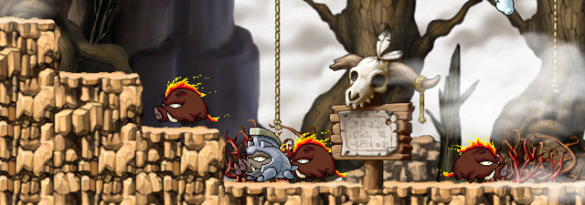
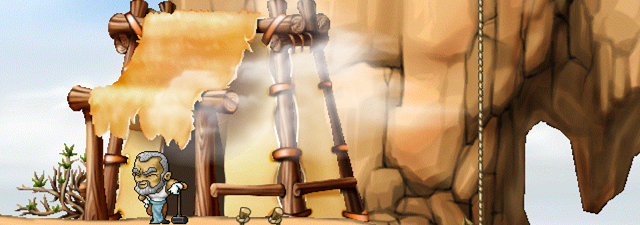

# 勇士部落

- 原帖地址：http://www.kmsfan.com/thread-10307-1-1.html
- 作者：观察者
如需转载请务必保留作者信息，注明转自剧情组并附上原帖地址

剧情组倾情奉献 冒险编年史：http://www.kmsfan.com/thread-4730-1-1.html

[[toc]]

## 基本信息

- 勇士部落地处金银岛北部，是一个建立在广袤无垠高原上的村落。相比较于南部平坦、舒适，相较安全的平原，这里留给人们的只有飞沙走砾和凶恶的怪物。恶劣的环境阻挡不了那些冲锋陷阵，保护队友的战士的步伐，随着一步步的开拓，一个“不屈”的村落犹如一颗种子般，从坚硬的岩石中破土而出。即使它是那么的简陋，那么的渺小，但是它一直是战士心中的一片圣地。

## 荒野上的村落

- 金银岛的北部在如今看来是一片不可思议的地方。无论是西方、东方还是最为适宜居住的南方，这里的一切仿佛都被一股奇怪的力量肆虐过，遗留下来的只有连绵的岩山还有预示着过去那茂密丛林遗留下来的树根。不同于魔法密林那幽森、也不同于射手村那一望无际，站在巅峰，一眼望去，仿佛一切都映入眼帘，然而层层云雾在岩山间缭绕，增添了一份神秘的色彩，让人欲罢不能，急切地驱使人们向它的更深处探索。恶劣的环境向人们宣告“禁止前进”，但是这一切却成为了那群人的“磨刀石”。跟随着赫丽娜来到维多利亚大陆的以坎泰伦为首的战士们，来到了北部最高的岩山，以此为基地建设家园，同时也在与凶恶的怪物和贫瘠的环境相抗衡，磨练自己的能力，这个地方就是今天的勇士部落。

## “凶恶”的居民？

- 当提及战士，映入我们的脑海中的形象无非是凶神恶煞，体格强健。勇士部落的居民也难以幸免，但是，在强大的自然面前，一切忽视他人的想法都随着有此想法的人被自然淘汰而销声匿迹。这里的居民不以自己的强大力量而自骄自傲，毅然承担着整个岛屿的保卫职责，同时为了村子而在野外抑制怪物对村落的袭扰。或者难以想象，管理部落日常事务的伊安仅仅是一介女流，但是在那里，性别不是阻碍，回想现实却只能叹息。她并不是勇士部落的人，只是村里人偶然在外发现并救治了失去记忆的她，她开始了在村里的生活，并以自己的努力，团结周围人在艰苦的环境中生存，同样她也肩负着金银岛警卫队的职责，安排人员处理岛内出现的各种问题。

- 相对于伊安的务实，部落里受到敬仰的酋长却显得特立独行。每当新人来到勇士部落后打算去见他，势必要提前准备好一定数量的树叶，在见面的时候送给他，这个时候他就开始宣传他的料理知识，可以说他是整个部落最懂得利用各种东西制作料理的顶级料理家。可能看起来一个堂堂的酋长居然是这个样子，非常不符合整个部落的风格，但是这何尝不是一种乐观的心态去面对生活的艰辛？或许在这个环境下，活下去往往才是第一要求，如何能充分利用有限的资源才能在生存斗争中存活，一个热爱厨艺的酋长，给这个沧桑的部落带来了生机。

## 灼热的荒原

- 勇士部落继续向北，那是一片怪物的乐园，野猪与木妖成群结队地在岩山间往返，不时袭扰探索的旅客和部落里的居民。五百多年前的上古时期，那时的原始野猪和苔藓木妖在金银岛北部植被相对较多的时候比现在显得更加巨大，随着人类帝国圣瑞尼亚的发展，金银岛北部植被大量遭到砍伐，环境恶化，怪物为了适应环境被迫改变自身的形态，苔藓木妖体型缩小退化为现在的各类体表干枯的小木妖，有的木妖还因为人类的砍伐，出现了斧木妖的形态。原始野猪因为获取食物的来源减少，由精壮短小的身体取代过去的肥大，有些野猪还因为人类的锻造而穿上了钢甲，出现了钢甲猪的形态，更有些因为灼热的环境而成为了火野猪。

- 同时，也诞生出一个强大的存在，被勇士部落的人称为守护树的树妖王。它庇护这片已经不能再受到任何破坏的濒临灭亡的土地，木妖看似干枯的身体，内部却藏着含有水分的树叶，为这片土地上的其他生物，提供生命所需的水，食物等等。然而现在的树妖王却变成了吸取大地养分的怪物，这种状态如果持续下去，勇士部落就会成变成寸草不生的死亡之地，考古发掘的芳博士期待着冒险家的讨伐。

## 神秘的遗迹发掘地

- 勇士部落的芳博士同魔法密林的巴缇博士，射手村的斯卡斯博士一样，都是金银岛研究生物进化，生态变化的著名学者，同时芳博士和发掘队队长杉峰也负责勇士部落新发现遗迹的发掘工作，这片废墟经研究发现是过去统治整个金银岛的人类帝国圣瑞尼亚的王宫，为了解过去的历史秘密提供了重要的资料，勇士部落的居民也积极为发掘队提供相应的帮助，以对抗恶劣的发掘环境。随着发掘的深入，意想不到的情况发生了，因为不明力量的影响，先是遭遇不明生物木面怪人和石面怪人的袭扰，后来发掘到王宫的军营处时，众多亡灵生物开始大规模出现。这对考古发掘工作造成了极大的阻碍，大部分考古人员被迫退出部分已经发掘的地区，在发掘地营地休整，派遣精英小队继续探查实情。然而一批批的探查人员最终无人返还，只能向强大的冒险家公会寻求帮助，各公会为展现自身实力，维护冒险岛世界安全，轰轰烈烈的公会对抗赛就此展开。

## 尘封的王朝

- 经现在残存的历史记载，大约七百多年前，强盛的圣瑞尼亚王国统一了整个维多利亚岛，即今天的金银岛，在现在勇士部落东北部的高原上建立了王宫，即圣瑞尼亚城。圣瑞尼亚城城墙坚固，机关巧妙，有神圣力量守护，国王锡安列三世贤能爱民，整个王国欣欣向荣。然而其兴也勃焉，其亡也忽焉，在国王锡安列三世获得传说中有使人永久年轻的宝石鲁碧安后，整个王国的发展突然急转直下，一个王国就突然间土崩瓦解，王宫附近成为不毛之地。直至今日，经过许许多多冒险家组结成的各个家族联盟的不断探索，王朝灭亡的秘密不断得到揭露。在地下的水路迷宫里，锡安列三世的遗书讲述了他被鲁碧安迷惑，招来恶魔艾里葛斯导致王国灭亡的历史情况。遗迹发掘地的突变也与那块传说中的宝石息息相关，还有那些零碎的关于少数幸存的人民与恶魔艾里葛斯的斗争。这一切的一切，只有那些遗物与漫天的飞尘，为我们诉说着那段悲惨的历史。

## 风土人情

## 本期旅行总结

- 纵使环境多么恶劣，勇士部落的人们都用自己的方式生存着，他们用热情打消了新人的迷惘，用力量守护着这片土地，用探索的心去揭露尘封的往事。无情的风沙看似掩盖了居民的友善，但是总能看到那些阴影，或许在那巅峰之上，或许是在野猪，亡灵等等怪物之间，你不知道他们是谁，他们也不曾留下自己的姓名，仅仅以自己的行动表明自己的态度。同样这是一片令人着迷的土地，神秘的王宫废墟依旧吸引着无数冒险家的探索，和同伴们一起谈笑风生，共同进退。这样的激荡起伏的冒险生活在老去的时候，或许就是对后辈教诲的谈资。

剧情组出品—
