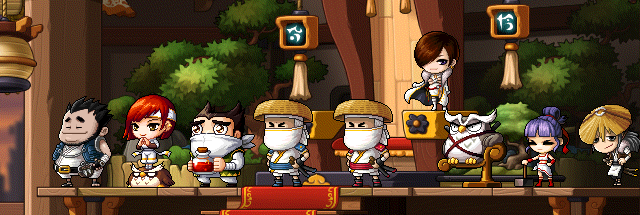

# 飞花院

- 原帖地址：http://www.kmsfan.com/forum.php/thread-4731-1-1.html
- 作者：斯乌、丨叶枫丨
如需转载请务必保留作者信息，注明转自剧情小组并附上原帖地址

剧情小组倾情奉献 冒险编年史：http://www.kmsfan.com/thread-4730-1-1.html

[[toc]]

暗影双刀（Blade Master）

首领：雪姬

据点：飞花院

目标：替前代复仇，重新掌管废弃都市

作风：互相信赖与绝对的效忠

## 历史

- 废都流飞侠的首领阵与暗影双刀的首领雪姬都曾出自同一师门，他们的师父是废都的前任黑暗领主，而阵与雪姬都是他最为优秀的得意弟子，阵很有天分，雪姬也很聪明 雪姬是前任黑暗领主的养女，两人自幼是青梅竹马成长，感情很好。

- 在一次讨伐巨型蝙蝠魔的任务中，黑暗领主不幸战死，而与他同行的阵却活了下来，并接替师傅的位子 掌管废都 成为了第8代黑暗领主，雪姬知道这些后认定这一切都是阵的阴谋，认为是阵借机谋害了她的父亲，于是她默默的离开了废都。

- 多年之后 在废都出现了这么一群神秘的人物，他们手持双刀，潜伏在废都高楼之中，声称自己才是废都真正的主人，而他们的归来只为了一件事，那就是复仇

## 黑暗领主

- 英文为Dark Lord，国服翻译为达克鲁。达克鲁并非人名，而是个称号，是废弃都市的首领 。现在的飞侠一转教官（阵），正是第8代黑暗领主。

## 首领的叫法

- 正统飞侠及废都的市民都称呼自己的首领为达克鲁，老一辈的人还会记得有黑暗领主这个称号，但自从阵继任后，更愿意市民称他为达克鲁。也许是不想提起往事。而暗影双刀组织成员称呼自己的首领为黑暗领主，则是出于对第7代黑暗领主的尊重与传承。但一些亲信弟子会称呼雪姬为“雪姬大人”，但雪姬本人更喜欢“雪姬小姐”这个叫法。

## 暗部档案

（一名暗部成员的日记，为你讲述废都那些尘封已久的过去）

*X月X日*

> 那一天，隐居在逆恩森林的家人惨遭盗贼杀害，失去意识的我被路过的双刀组织成员从废墟中救出，为了报答他们的恩情 同时也是为了获得力量后终有一天能向那些杀害自己家人的盗贼复仇 决定加入飞花院为其效忠。自从加入暗影双刀这个大家庭后，西瓦老师每天都在训练我们这些新忍，这里的同伴们相处的都很融洽，但不知为何 他们的眼中总是透着一丝悲伤的神色，我知道 也许这里的人们都曾有过曲折的过去吧

*X月X日*

> 加入飞花院已有些时日，红雅老师似乎认为我具备某些特殊的潜质，于是将我推荐给我们的黑暗领主（雪姬），让我成为了一名雪姬小姐直属的暗部组织成员。在与雪姬小姐的交谈中，她跟我讲起了先代黑暗领主与“达克鲁”的故事，为了除掉叛变者 阵，需要有人潜入废弃都市的内线取得现任达克鲁的信任 里应外合，决定让新人脸的我来执行此次卧底任务。在红雅老师的指导下，历经百般严格的训练，战胜各种磨难终于通过了间谍预备教育的所有课程，而在课程结束的最后 红雅老师要求我喝下毒药以示自己绝对不会背叛的忠心。“就算知道是毒药也会服下，飞花园就是需要这样的人！”红雅老师那句斩钉截铁的话我一直深深铭记着。直到后来见过雪姬小姐才知道，原来这只是一个恶作剧……“同伴之间互相信任 这才是我们飞花流的做派”雪姬小姐如此对我说道。

*X月X日*

> 通过了飞侠一转考试，我正式作为飞花院的间谍开始接近达克鲁。在红雅老师的教导下，我装扮成一般的新手加入了达克鲁的派系，再假装和废都周围的人们搞好关系以便打听更多的情报。经过一番探查后了解到这里的人们普遍对阵成为第八代黑暗领主以及先代领主的突然失踪感到奇怪，并且还听到了达克鲁会经常在沼泽地出没且每周都会收到快递的传闻。得到这消息的红雅老师也很是疑惑，决定继续调查下去，但他还是建议我加以修炼再接受接下来的任务。于是我返回飞花院向雪姬小姐汇报了任务的进展并得到了转职成见习双刀的许可

*X月X日*

> 今天像往常一样打算出门修行，延友小姐却突然追上我 说是雪姬小姐最近总是闷闷不乐的样子 希望我在外出时能顺便去沼泽地采些花转交给雪姬。看到鲜花的雪姬小姐似乎心情舒畅了很多，但还是有一丝说不出的惆怅，她在旁自然自语的开始讲起当年先代黑暗领主与其战友崔斯坦手下惨死在阵含糊的回忆。“他肯定没料到我会跟踪他们，还看到了这一切！！” 雪姬小姐这话中虽略带仇恨，却有种莫名其妙的痛苦…

*X月X日*

> 我收到了红雅老师传来的秘密通讯，老师觉得达克鲁的快递有调查的余地。于是我立即前往勇士部落，并用手段取得兼职生邮递员的信任借机带走达克鲁的邮件。经老师一番细查后却没能发现有价值的线索，无奈只得转变调查的方向。后来他跟踪观察到达克鲁确实在沼泽地与外人有联系，命令我前往打探。在沼泽地带的小屋里我悄悄越过里面的守卫并从垃圾桶里偷换走了一个文件，老师过目后大吃一惊 原来达克鲁一直在调查雪姬小姐和飞花院，得知组织的暴露，红雅老师决定立即展开全面的调查。于是他调动一队人员引开达克鲁离开爵士酒吧，而我就趁机对里面地毯式搜索，终于在他的房间的隐秘处发现了达克鲁的日志，这次调虎离山之计总算有收获。然后我们顺藤摸瓜在魔法密林附近找到一个关键人物- 杰比。

*X月X日*

> 我们在杰比那打听到一些关于历代黑暗领主经年累月与企图颠覆世界的人做对抗的故事 他们发现有人在枫世界的阴影中偷偷扭曲历史，于是先代黑暗领主和他的弟子阵开始追踪那个人。可是 由于敌人的阴谋，先代领主与战友崔斯坦双双牺牲，现任达克鲁考虑到还要继续跟踪下去，意识到协助调查的杰比也会被卷入危险之中，于是把杰比藏在魔法密林并派手下加以保护，而他依然独自在暗夜中守护枫界的和平…

> 难道雪姬小姐一直以来都误解了现任的达克鲁？难道我们暗影双刀的怨恨一直以来都是因为这个误会而诞生？虽然有些难以置信 但我还是把情况如实汇报给了红雅老师，老师也很是震惊，但他还是决定要去确认这个“误会”，在老师的指引下我来到当年的战场（地下寺院），偶然间 我遇见了崔斯坦的灵魂，崔斯坦向我说明这个“误会”的一切。原来当年雪姬小姐突然昏迷是因为遭到敌人的附身被挟持做人质，他们三人面对这样的局面都不敢轻举妄动，敌人趁机命令巨型蝙蝠魔杀死了先代黑暗领主和崔斯坦，就剩下彷徨的阵，为了保护雪姬小姐他将所有误会和污名都揽到自己身上。“带领废气都市飞侠的黑暗领主啊，被一个无言的阴影笼络着，悲惨…痛苦……”崔斯坦用这句话表达了无奈与自责，最后他允许我带走了遗物中的一份记录，里面记载着寻找巨型蝙蝠魔的过程。

*X月X日*

> 回去后 我将在地下寺院发生的事向红雅老师做了汇报，老师的神色也多了一份忧虑，决定终止一切关于达克鲁的调查，并安排我自行修炼。 回到飞花院 我收到雪姬小姐的转职邀请，经过紧张的考试后我顺利通过正式转职为双刀客，在嘉奖的时候雪姬小姐对我的成长感到欣慰，又开始自然自语讲起了前代领主的事，“我希望你也能拥有一颗善良的心，就像他一样。”，雪姬小姐笑着对我说到，原来雪姬小姐也拥有这样的笑容

*X月X日*

> 成为双刀客的那天起，我开始接受组织各种等级的任务，经历了一段漫长的修炼，最近我收到红雅老师的暗号通讯，要求我速回飞花院。原来，我们已经决定要以组织的名义与现任达克鲁进行直接会面，确认那个“误会”的最终结果，在废弃都市的爵士酒吧里，这里的暗阁是达克鲁的本部，红雅老师把之前调查到的证据都摊出来询问达克鲁 阵，面对红雅的提问 达克鲁显得格外平静，他承认了先代黑暗领主不是他杀害的，至于为什么一直隐瞒这个真相导致如今雪姬小姐埋下深仇大恨，他只是感慨了一句“如果我说出真相，雪姬会成长为现在这个样子吗？”为了不让雪姬小姐因为自己被捉去做人质连累先代黑暗领主惨死敌人手下 而在自责中堕落崩溃，阵…隐瞒了真相，承担了一切，选择了背负莫须有的骂名 成为被憎恨的对象 让雪姬怀着对他的恨意磨练自己坚强的活下去

> 在憎恨中变强，曾几何时我也失去过家人，我也因为自己的无能感到自责，我无法保护我心爱的家人…但是，因为憎恨，因为暗影双刀，因为雪姬小姐，我找到了活下去的理由，我如此努力地训练自己，就是为了有朝一日可以为我的家人报仇！而，雪姬小姐生存的理由，不就跟我一样吗…

> 面对这个看似荒唐的真相，雪姬小姐会怎样呢，无疑 这是最刺痛的讽刺。离开酒吧后红雅老师决定把真相说出来，写了一份报告书叫我送过去。雪姬小姐看过报告之后 如此坚强的她还是不自觉的落下了眼泪，这在预料之中，也在预料之外。后来我被命令现行退下……

*X月X日*

> 我收到组织的转职考试通知，在林中之城的隐秘处我击败了所有冰龙，虽然过程有点曲折，但我还是完成了。在残酷的逆境中脱颖而出，这是我们暗影双刀的意志，嘉奖时 我再次见到雪姬小姐，好久不见，她神色平静，仍有一贯成熟的气质，似乎已经忘记了那件事…见到一直在成长的我，她微笑地感慨着。

*X月X日*

> 雪姬小姐突然召见了我。经过深思熟虑后，她决定跟达克鲁言和，是为了废气都市，为了先代黑暗领主，为了对抗共同的敌人。不过在此之前，希望我能证明给达克鲁看暗影双刀的实力！于是，肩负着雪姬小姐的期待，肩负着组织的名誉 我作为暗影双刀的代表堂堂正正的地站在达克鲁面前转达了我们的意志。达克鲁为了考验我召唤分身应对，听说 只有打败达克鲁分身的冒险家才能通过三转的考试。而我们暗影双刀，绝不逊色于冒险家，经历一场激烈的对决后 我用双刀独特的战斗技巧击败了达克鲁的分身，看到如此强大的实力 达克鲁欣慰地笑了，他也从中领略到雪姬小姐的意志，决定接受暗影双刀，重新结为统一的飞侠，站在同一战线对抗敌人

*X月X日*

> 最近达克鲁以他的名义向冰封雪域和神木村推荐了我们组织成员参加三转四转的考试，我们飞花流的双刀飞侠也渐渐为世人所知，为了对抗更强大的敌人，我们的组织开始透明化，越来越多的冒险者加入组织接受训练，也越来越多的人了解到先代黑暗领主和英雄崔斯坦的故事，那些封尘已久的绝密档案都已不再是秘密

> 暗影双刀的崛起成为枫世界中一股不可忽视的势力，在圣地举行的大陆会议中，达克鲁和雪姬小姐都受到希纳斯女皇的邀请，带着飞侠的意志、暗影双刀的意志，还有废气都市的意志 他们两人参加了圣地大陆会议，与枫世界各方势力交流了志向并结成联盟，强强联手 共同保护这个世界，而我也将继续见证双刀的辉煌。

## 飞花院

- 飞花院坐落于飞侠聚地 废弃都市的后街深处，由于是老城区，有着很好的隐蔽性，这里曾是第7代黑暗领主及其子弟居住过的地方，7代目逝世后，他的得意子弟阵继任并开拓废弃都市，将本部迁移至新城区。时隔多年 雪姬带着自己组织的暗影双刀重新回到了这里。

- 飞花院独特结构充分体现出废都流随意的建筑特色，其外形古雅却略显现代化，是由木桩、砖头、瓦片为主混合构成的大型建筑，外部以白墙为主，并有着排气扇、窗口、爬梯、排水管等现代化简便装饰特色；内部是木质为主的古风构造，潇洒的书法横幅、大方的席帘、精致的灯笼处处可见，且设施完善，拥有针对各种类型战斗的训练场所。

- 历经长年的风霜，飞花院多处战斗过的痕迹也变得特别显眼，穿插在墙边生锈的苦无、墙上细小的裂缝、外露的砖头等等，它残旧却矫健的身躯犹如双刀的意志一样屹立在废都的隐蔽处，伺机待发……

### 组织构成

- 暗影双刀是由雪姬所领导的组织，组织内部分工明确，每个不同特长的成员都会被分配到对应的位置，以此最大化组织的行动效率。

首领（负责指挥组织的总体运作及带领组织达成意向。）

亲信（曾经同雪姬和阵一样是第7代黑暗领主的弟子，一直追随着雪姬的部下，如今视阵如叛变者，并效忠于雪姬，绝对服从。负责管理组织各项部门，成为雪姬的左肩右臂。）

暗部（雪姬的直属精锐部队，是从众多成员中挑选出来的精英，由首领直接委托，用于处理特殊任务，其任务性质一切皆为机密。）

前线（组织当中的普通成员，由首领的下属带领，负责执行组织各种公开任务，任务的形式五花八门分工明确，多为组队行动。）

### 级别判定

- 暗影双刀组织中用六种级别来衡量成员的实力，不同级别的成员会对应到不同级别领域的任务，要想进行高级别的任务就需要先提升自己的级别，参加严厉的级别考试，以此鼓励成员自身锻炼。

他们分别为：飞侠→见习双刀→双刀客→双刀侠→血刀→暗影双刀

曾被誉为“暗影双刀”的前代黑暗领主

- 在与雪姬的对话中我们看到一句这样的话，这句话看似简单，但其实蕴藏着深奥的故事。可以这么理解，双刀的技术以前曾存在过，是先代黑暗领主的独创技能。先代去世后，雪姬带着学过双刀技术的亲信弟子离开废都，根据以前父亲留下来的技术学习研究并创立了飞花院的暗影双刀。可见“暗影双刀”这个组织不仅仅是仇恨的萌芽，更多的是对先代黑暗领主精神上的传承，寄托雪姬对父亲的思念

## 职业特色

- 所谓暗影双刀，顾名思义就是擅长使用两把刀战斗，他们放下了盾牌，持起另一把刀，舍弃了坚固的防御能力，以此升华自身的极速回避，将一切赌在致命的双击。而作为冒险岛世界首个拥有双武器的职业，创下“最高攻击段数”的记录，拥有“1秒16斩”的恐怖称号，而攻速快、高回避、最致命等因素正是暗影双刀的战斗精髓。

## 相关人物介绍

### 第7代黑暗领主

- 其真名不详，他就是前任黑暗领主，对雪姬来说他是一位慈祥的父亲，同时也是现任黑暗领主·阵 所仰慕的伟大老师，他的逝去是一个悲剧，也因为他的死，改变了废弃都市的历史。

### 雪姬

- 第7代黑暗领主的养女，原本是预计接替父亲位置的人，但是因为父亲的去世使她陷入仇恨当中，从而组织了暗影双刀向废弃都市复仇。

### 崔斯坦

- 第7代黑暗领主的战友，在蚂蚁洞深处发现古老魔兽即将复活的他，向7代领主发出求援请求，在那次讨伐战中与7代领主一同牺牲。如今他的灵魂依然徘徊在当年的战场，向路过的冒险者述说着当年的一切。只有拥有强烈意志的人才能见到崔斯坦的灵魂。

### 斯乌

- 黑魔法师的军团长之一，在上古之战中受到重创导致肉体与灵魂分离，那一战之后他的灵魂意外的得到了附身的奇异能力游荡于世界各处，不断删除和改变对于他们不利的历史。是他促成了那场讨伐战的悲剧，改变了整个废都历史的轨迹……

### 阵

- 他就是我们熟知的冒险家飞侠一转教官，同时也是第8代黑暗领主，在那一次讨伐战中目睹恩师的死而变得坚强起来，为了保护雪姬，他隐藏真相背负骂名，为了不牵连他人，他独自战斗。因为当年应下老师的承诺，即使剩下自己一个也要守护好老师所深爱的这座黄昏之都

剧情组出品—
